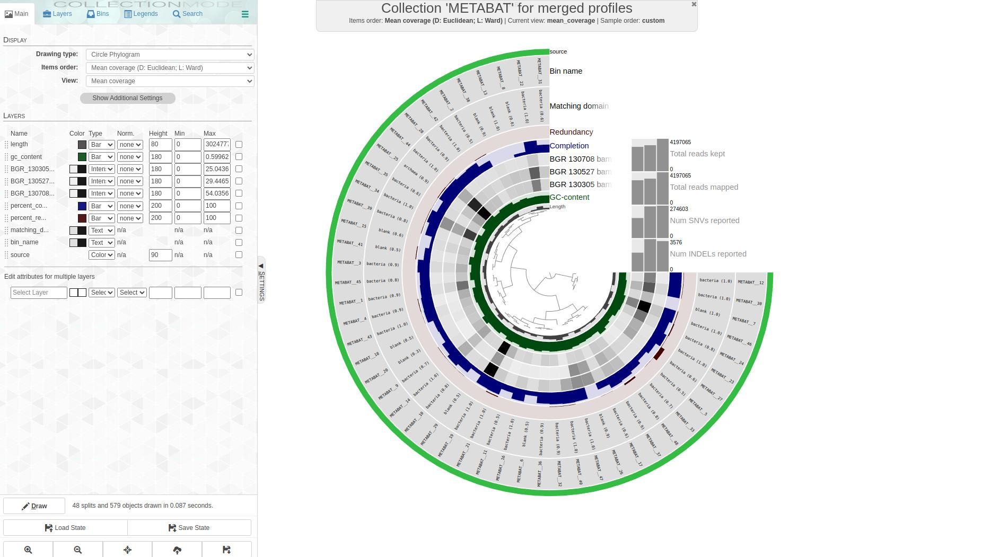

# test_biol217
Test repo for biol217

# Day-1 

## Introduction to linux

We have learned here how to do the followings:

1. Comand line tool
2. Basic linux commands

To `make a new folder` use this code

```
mkdir foldername
```

# Links

[Github](https://github.com/SGruetzke/test_biol217) 

[Name](Link)

# Pictures

