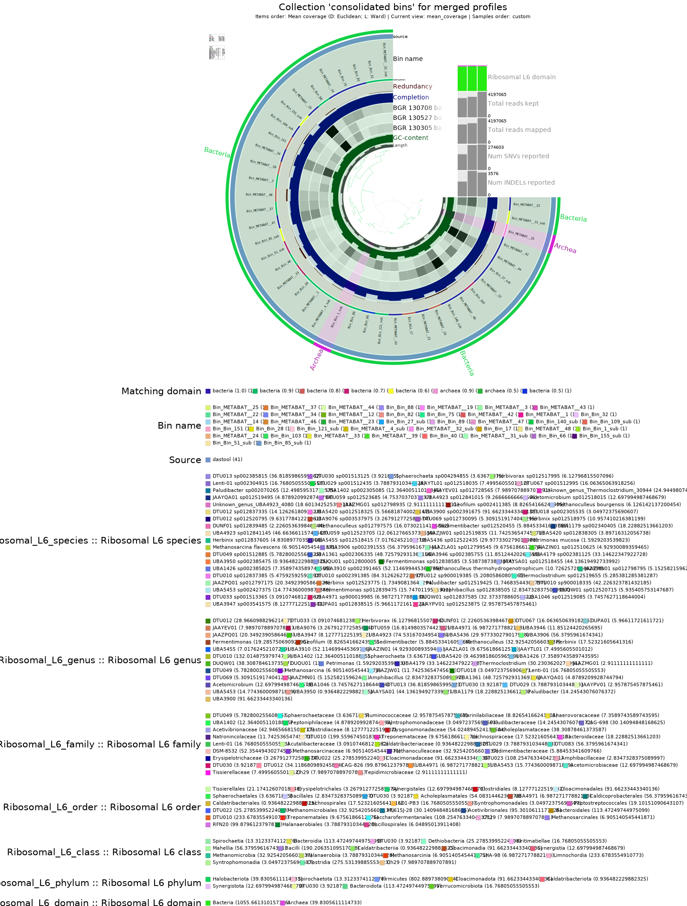
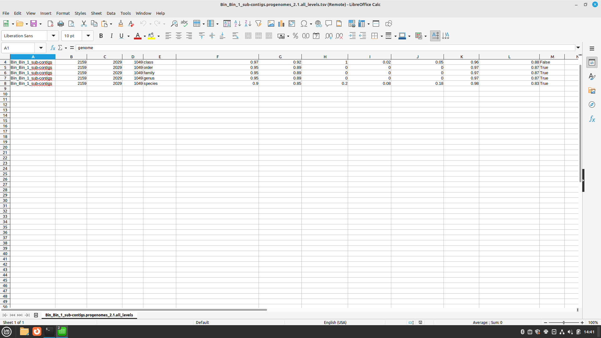
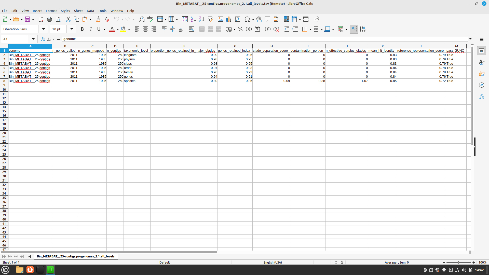

# Day 5

## Tutorial
```
(base) kurs@Kurs006:~$ ssh -X sunam232@caucluster-old.rz.uni-kiel.de
[sunam232@caucluster2 ~]$ cd $WORK
[sunam232@caucluster2 sunam232]$ conda activate /home/sunam225/miniconda3/miniconda4.9.2/usr/etc/profile.d/conda.sh/envs/anvio-7.1
(anvio-7.1) [sunam232@caucluster2 sunam232]$ cd ./day_03
(anvio-7.1) [sunam232@caucluster2 day_03]$ cd ./5_anvio-profiles/
(anvio-7.1) [sunam232@caucluster2 5_anvio-profiles]$  anvi-estimate-genome-completeness -p /work_beegfs/sunam232/day_03/5_anvio-profiles/5_anvio_profiles/merged_profiles/PROFILE.db -c /work_beegfs/sunam232/day_03/5_anvio-profiles/contigs.db --list-collections
```
Das wird ausgegeben:
```
COLLECTIONS FOUND
===============================================
* CONCOCT (156 bins, representing 57626 items).
* consolidated_bins (41 bins, representing 13825 items).
* METABAT (48 bins, representing 8943 items).
```
Terminal 1
```
(anvio-7.1) [sunam232@caucluster2 5_anvio-profiles]$ srun --reservation=biol217 --pty --mem=10G --nodes=1 --tasks-per-node=1 --cpus-per-task=1 --partition=all /bin/bash
[sunam232@node010 5_anvio-profiles]$ conda activate /home/sunam225/miniconda3/miniconda4.9.2/usr/etc/profile.d/conda.sh/envs/anvio-7.1
(anvio-7.1) [sunam232@node010 5_anvio-profiles]$ anvi-interactive -p /work_beegfs/sunam232/day_03/5_anvio-profiles/5_anvio_profiles/merged_profiles/PROFILE.db -c /work_beegfs/sunam232/day_03/5_anvio-profiles/contigs.db -C METABAT
```
New terminal:
```
(base) kurs@Kurs006:~$ ssh -L 8060:localhost:8080 sunam232@caucluster-old.rz.uni-kiel.de
[sunam232@caucluster2 ~]$ ssh -L 8080:localhost:8080 node010
```
Firefox:
```
http://127.0.0.1:8060

```

close terminal & exit node

```
(anvio-7.1) [sunam232@caucluster2 5_anvio-profiles]$ anvi-estimate-genome-completeness -c /work_beegfs/sunam232/day_03/5_anvio-profiles/contigs.db -p /work_beegfs/sunam232/day_03/5_anvio-profiles/5_anvio_profiles/merged_profiles/PROFILE.db -C consolidated_bins
```
to save it:
```
(anvio-7.1) [sunam232@caucluster2 5_anvio-profiles]$ anvi-estimate-genome-completeness -c /work_beegfs/sunam232/day_03/5_anvio-profiles/contigs.db -p /work_beegfs/sunam232/day_03/5_anvio-profiles/5_anvio_profiles/merged_profiles/PROFILE.db -C consolidated_bins > genome_completeness_dastool.txt 
```

## Bin refinement
```
(anvio-7.1) [sunam232@caucluster2 Day5]$ sbatch anviscript 
```
Script:
```
#summarize
#anvi-summarize -c /work_beegfs/sunam232/Day5/contigs.db -p /work_beegfs/sunam232/Day5/5_anvio_profiles/merged_profiles/PROFILE.db -C consolidated_bins -o SUMMARY_02 --just-do-it
```
Terminal 1
```
(anvio-7.1) [sunam232@caucluster2 bin_by_bin]$ cp /work_beegfs/sunam232/Day5/5_anvio_profiles/SUMMARY_FINAL/bin_by_bin/Bin_METABAT__25/*.fa /work_beegfs/sunam232/Day5/5_anvio_profiles/ARCHAEA_BIN_REFINEMENT/
```
```
(anvio-7.1) [sunam232@caucluster2 bin_by_bin]$ cp /work_beegfs/sunam232/Day5/5_anvio_profiles/SUMMARY_FINAL/bin_by_bin/Bin_Bin_1_sub/*.fa /work_beegfs/sunam232/Day5/5_anvio_profiles/ARCHAEA_BIN_REFINEMENT/

sbatch anviscript 
```
Script:
```
#GUNC
cd /work_beegfs/sunam232/Day5/5_anvio_profiles/ARCHAEA_BIN_REFINEMENT/
mkdir GUNC
for i in *.fa; do gunc run -i "$i" -r /home/sunam226/Databases/gunc_db_progenomes2.1.dmnd --out_dir GUNC --threads 10 --detailed_output; done
```
Terminal 1
```
(anvio-7.1) [sunam232@caucluster2 Day5]$ srun --reservation=biol217 --pty --mem=10G --nodes=1 --tasks-per-node=1 --cpus-per-task=1 /bin/bash
(base) [sunam232@node002 Day5]$ conda activate /home/sunam225/miniconda3/miniconda4.9.2/usr/etc/profile.d/conda.sh/envs/anvio-7.1
(anvio-7.1) [sunam232@node002 Day5]$ anvi-refine -c /work_beegfs/sunam232/Day5/contigs.db -C consolidated_bins -p /work_beegfs/sunam232/Day5/5_anvio_profiles/merged_profiles/PROFILE.db --bin-id Bin_METABAT__25
```
Neues Terminal
```
(base) kurs@Kurs006:~$ ssh -L 8060:localhost:8080 sunam232@caucluster-old.rz.uni-kiel.de
[sunam232@caucluster2 ~]$ ssh -L 8080:localhost:8080 node010
```
Firefox
```
http://127.0.0.1:8060
```
Terminal 1
```
(anvio-7.1) [sunam232@caucluster2 Day5]$ sbatch anviscript 
#anvi-run
anvi-run-scg-taxonomy -c /work_beegfs/sunam232/Day5/contigs.db -T 20 -P 2
```
```
(anvio-7.1) [sunam232@caucluster2 Day5]$ sbatch anviscript 
#anvi-estimate
anvi-estimate-scg-taxonomy -c /work_beegfs/sunam232/Day5/contigs.db --metagenome-mode
```
Output in output-folder
```
(anvio-7.1) [sunam232@caucluster2 Day5]$ sbatch anviscript 
```
```
#summarize
anvi-summarize -c /work_beegfs/sunam232/Day5/contigs.db -p /work_beegfs/sunam232/Day5/5_anvio_profiles/merged_profiles/PROFILE.db -C consolidated_bins -o SUMMARY_03 --just-do-it
```
## notes
bam -> binning -> bins -> refine (3 steps: combination of binners, chimeras, reassembly) -> Taxonomy ANI 


## Question

    Do you get bins that are chimeric?
    hint: look at the CSS score (explained in the lecture) and the column PASS GUNC in the tables outputs per bin in your gunc_output folder.
    In your own words (2 sentences max), explain what is a chimeric bin.

  - The METABAT data are not chimeric
  - The CONCOT data are chimeric on kingdom, phylum and class level
  - `what is a chimeric bin?`


## Questions

Does the quality of your Arrchaea improve?
hint: look at completeness redundancy in the interface of anvio and submit info of before and after
Submit your output Figure
The completeness decreases from 97.37% to 93.4%. The Redundance did not change (5.3). The obvious low quality were removed, so the quality should be a little bit better. But we can not see changes in the Redundance as a marker for the quality.





## Questions

how abundant are the archaea bins in the 3 samples? (relative abundance)
**you can also use anvi-inspect -p -c, anvi-script-get-coverage-from-bam or, anvi-profile-blitz. Please look up the help page for each of those commands and construct the appropriate command line

Bin_METABAT__25:
- BGR_130305: 1.76
- BGR_130527: 1.14
- BGR_130708: 0.58

Bin_Bin_1_sub
- BGR_130305: 0.96
- BGR_130527: 0.00
- BGR_130708: 0.40


## Questions

Did you get a species assignment to the
bins previously identified?
Does the HIGH-QUALITY assignment of the bin need revision?
hint: MIMAG quality tiers

Yes at Bin_Bin_1_sub is a species level
at Bin_METABIT__25 is just genus level
