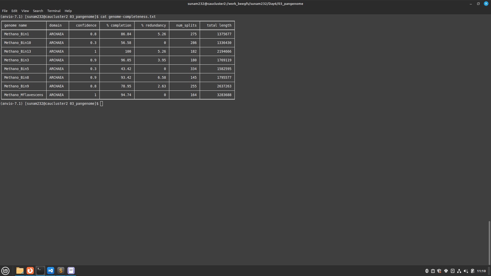
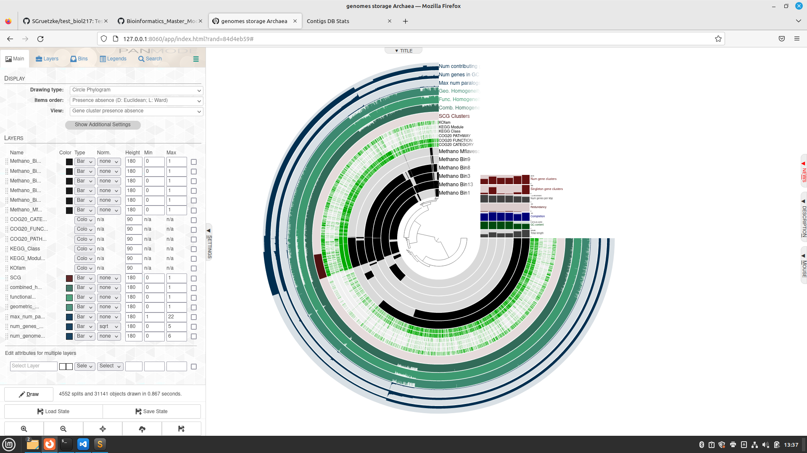

### Day 6

### Terminal 1

```
(base) kurs@Kurs006:~$ ssh -X sunam232@caucluster-old.rz.uni-kiel.de
sunam232@caucluster-old.rz.uni-kiel.de's password: 
[sunam232@caucluster2 ~]$ cd $WORK
[sunam232@caucluster2 sunam232]$ conda activate /home/sunam225/miniconda3/miniconda4.9.2/usr/etc/profile.d/conda.sh/envs/anvio-7.1
(anvio-7.1) [sunam232@caucluster2 sunam232]$ ls
day_02  day_03  day_04  Day5  Day6
(anvio-7.1) [sunam232@caucluster2 sunam232]$ cd ./Day6
(anvio-7.1) [sunam232@caucluster2 Day6]$ ls
02_contigs-dbs  03_pangenome
(anvio-7.1) [sunam232@node010 Day6]$ ls
02_contigs-dbs  03_pangenome  anviscript
(anvio-7.1) [sunam232@node010 Day6]$ cd ./02_contigs-dbs/
(anvio-7.1) [sunam232@node010 02_contigs-dbs]$ anvi-display-contigs-stats *db
```
### Terminal 2
```
(base) kurs@Kurs006:~$ ssh -L 8060:localhost:8080 sunam232@caucluster-old.rz.uni-kiel.de
sunam232@caucluster-old.rz.uni-kiel.de's password: 
[sunam232@caucluster2 ~]$ ssh -L 8080:localhost:8080 node{010}
ssh: Could not resolve hostname node{010}: Name or service not known
[sunam232@caucluster2 ~]$ ssh -L 8080:localhost:8080 node010
bind: Address already in use
channel_setup_fwd_listener_tcpip: cannot listen to port: 8080
Could not request local forwarding.
Last login: Fri Jan 27 13:58:06 2023 from caucluster2.adm.cluster.rz.uni-kiel.de

```
### Firefox

 http://127.0.0.1:8060

### Question

How do the MAGs compare in size and number of contigs to the full genome?

Answer
`Bild einfügen`
The full genome has just one contig with a length og 3,283,688. The MAGs have a number of contigs between 137 and 334. The legth of the different contigs is diverse between the different MAGs. There are a few with a length above 50 kb. The most are shorter than 5 kb.

Question: Based on the contig numbers, sizes and number of marker genes (HMM hits), which two MAGs are the best and which is the worst?


Answer

 With the highest number of contigs but very short contigs Bin5 is the worst. The best ones are Bin13 (longest contigs and not many contigs and big genome) and Bin 19 (big genome and long contigs)

### Terminal 2

close

### Terminal 1

strg C

exit
```
(anvio-7.1) [sunam232@caucluster2 Day6]$ cd ./03_pangenome/
(anvio-7.1) [sunam232@caucluster2 03_pangenome]$ anvi-script-gen-genomes-file --input-dir ../02_contigs-dbs/  -o external-genomes.txt
```

```
Contigs databases ............................: 8 found.                                                                                                                                                                               
External genomes file ........................: external-genomes.txt
```
```
(anvio-7.1) [sunam232@caucluster2 03_pangenome]$ cat external-genomes.txt 
```
Output:
```
name	contigs_db_path
Methano_Bin1	/work_beegfs/sunam232/Day6/02_contigs-dbs/Bin1.db
Methano_Bin10	/work_beegfs/sunam232/Day6/02_contigs-dbs/Bin10.db
Methano_Bin13	/work_beegfs/sunam232/Day6/02_contigs-dbs/Bin13.db
Methano_Bin3	/work_beegfs/sunam232/Day6/02_contigs-dbs/Bin3.db
Methano_Bin5	/work_beegfs/sunam232/Day6/02_contigs-dbs/Bin5.db
Methano_Bin8	/work_beegfs/sunam232/Day6/02_contigs-dbs/Bin8.db
Methano_Bin9	/work_beegfs/sunam232/Day6/02_contigs-dbs/Bin9.db
Methano_Mflavescens	/work_beegfs/sunam232/Day6/02_contigs-dbs/Mflavescens.db
```

```
(anvio-7.1) [sunam232@caucluster2 03_pangenome]$ anvi-estimate-genome-completeness -h
```
`Output PiCture`

Question: How do the bins compare to isolate genomes? Would you remove one, based on the output of the completeness estimation?



remove over 10% redundancy and under 70% completeness: Bin_10 and Bin_5


### Terminal 1

`new Folder in 02_contigs.db : discarded`
`move Bin_10 und Bin_5 in discarded`

```
(anvio-7.1) [sunam232@caucluster2 03_pangenome]$ aanvi-script-gen-genomes-file --input-dir ../02_contigs-dbs/  -o external-genomes_02.txt
```
```
(anvio-7.1) [sunam232@caucluster2 Day6]$ sbatch anviscript 
```
Skript
```
#!/bin/bash
#SBATCH --nodes=1
#SBATCH --cpus-per-task=10
#SBATCH --mem=500M
#SBATCH --time=00:05:00
#SBATCH --job-name=./03_pangenome
#SBATCH --output=./03_pangenome.out
#SBATCH --error=./03_pangenome.out
#SBATCH --partition=all
#SBATCH --reservation=biol217


# for pangenome
conda activate /home/sunam225/miniconda3/miniconda4.9.2/usr/etc/profile.d/conda.sh/envs/anvio-7.1

# set working directory by navigating there
cd ./03_pangenome/

# Insert your command here
anvi-gen-genomes-storage -e /work_beegfs/sunam232/Day6/03_pangenome/external-genomes_02.txt -o methano-storage-GENOMES.db

anvi-pan-genome -g methano-storage-GENOMES.db --project-name genomes-storage_Archaea --num-threads 10

```
```
(anvio-7.1) [sunam232@caucluster2 Day6]$ sbatch anviscript 
```
Script
```
#!/bin/bash
#SBATCH --nodes=1
#SBATCH --cpus-per-task=10
#SBATCH --mem=600M
#SBATCH --time=00:02:00
#SBATCH --job-name=./ANI
#SBATCH --output=./ANI.out
#SBATCH --error=./ANI.out
#SBATCH --partition=all
#SBATCH --reservation=biol217


# for pangenome
conda activate /home/sunam225/miniconda3/miniconda4.9.2/usr/etc/profile.d/conda.sh/envs/anvio-7.1

# set working directory by navigating there
cd ./03_pangenome/

# Insert your command here

anvi-compute-genome-similarity --external-genomes external-genomes_02.txt --program pyANI --output-dir ANI --num-threads 10 --pan-db ./genomes-storage_Archaea/genomes-storage_Archaea-PAN.db


```
### Question
Scroll to the top of the help and find out which INPUT FILES you need. Write the command and use the additional flag -P. What is the -P flag for?

Answer: that we can use different ports, that we don't mix up our data

### Terminal 1
```
(anvio-7.1) [sunam232@caucluster2 Day6]$ srun --pty --mem=10G --nodes=1 --tasks-per-node=1 --cpus-per-task=1 --reservation=biol217 --partition=all /bin/bash
[sunam232@node010 Day6]$ conda activate /home/sunam225/miniconda3/miniconda4.9.2/usr/etc/profile.d/conda.sh/envs/anvio-7.1
(anvio-7.1) [sunam232@node010 Day6]$ anvi-display-pan -p ./03_pangenome/genomes-storage_Archaea/genomes-storage_Archaea-PAN.db -g ./03_pangenome/methano-storage-GENOMES.db -P 8088
```
### Terminal 2
```
(base) kurs@Kurs006:~$ ssh -L 8060:localhost:8080 sunam232@caucluster-old.rz.uni-kiel.de 
sunam232@caucluster-old.rz.uni-kiel.de's password: 
[sunam232@caucluster2 ~]$ ssh -L 8088:localhost:8088 node010
Last login: Mon Jan 30 10:20:56 2023 from caucluster2.adm.cluster.rz.uni-kiel.de

```
### Firefox

http://127.0.0.1:8060

### Output



### Tasks

Question: Based on the frequency clustering of genes, do you think all genomes are related? Why?

Answer: I don't think so. The phylogenetic tree is splitted into two lineages.

Question: How does the reference genome compare to its closest bin? Tip: Consider the genome depiction and layers above
Answer: There are are a lot of similarities but also differences. So you can see that they are phylogenetic close to each other.


Questions: What ranges are used determine a prokaryotic species? How high can you go until you see changes in ANI? What does the ANI clustering tell you about genome relatedness?
Answer: > 95 % we talk about different species. You don't see changes until 0.98 between Methano Bin9 and Methano Mflavescens. If there is the same colour at 95 % or less it is the same species. So we have one bin which is closely related to the genome: Bin9.

Question: How are Methanogenesis genes distributed across the genome?

Answer: They are distributed almost over the hole genome. Behind the SCG-part is a hole where is just one Methanogenesis.


Question: What observations can you make regarding the geometric homogeneity between all genomes and the functional homogeneity?

Answer: The geometric homogeneity and functional homogeneity are between Methano_Bin9 and Methano_Mflavescens the same and between the four others the same. Between the both groups are some differents but not a lot. So you see the relationships in such conserved genes.


## Bonus
Question: Can the organism do methanogenesis? Does it have genes similar to a bacterial secretion system?

Answer: Yes and yes


### Terminal 1 & 2
node verlassen

### Terminal 1
