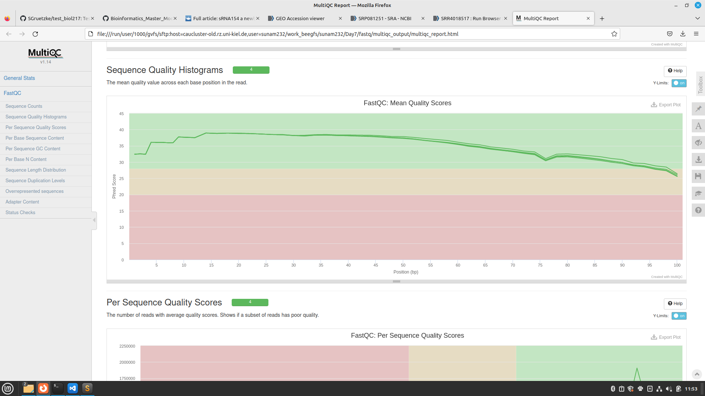

# Day 7

## Lecture Transcriptomics

# Experimental design
 more replicates min. 3 are good (depends on situation and money)
 if we use just one replicate we can't see if there are any mistakes with it

 length: `50?/100 bp?/150?`


1. chop
2. sequence
3. map
   

## Tutorial
```
(anvio-7.1) [sunam232@caucluster2 ~]$ conda activate /home/sunam226/.conda/envs/grabseq
```

have a look in paper  Prasse et al. 2017

search for ncbi -> find: GEO Series accession number GSE85456 (https://www.ncbi.nlm.nih.gov/geo/query/acc.cgi?acc=GSE85456)

follow link
click link SRA (SRP081251)
found out SRR-numbers:

GSM2267310: ∆sRNA154 replicate 2; Methanosarcina mazei Go1; RNA-Seq: `SRR4018517`
GSM2267309: ∆sRNA154 replicate 1; Methanosarcina mazei Go1; RNA-Seq: `SRR4018516`	
SRX2012144: GSM2267308: wildtype replicate 2; Methanosarcina mazei Go1; RNA-Seq: `SRR4018515`
SRX2012143: GSM2267307: wildtype replicate 1; Methanosarcina mazei Go1; RNA-Seq: `SRR4018514`


download

```
(grabseq) [sunam232@caucluster2 Day7]$ fasterq-dump SRR4018517 SRR4018516 SRR4018515 SRR4018514

```
csv-Datei (with SRP number you can download all SRR together)

```
(grabseq) [sunam232@caucluster2 fastq]$ grabseqs sra -l -t 4 -m metadata.csv SRP081251
```
rename fastq data

### Quality Control

```
(grabseq) [sunam232@caucluster2 Day7]$ sbatch anviscript
```
Script:
```
cd fastq/
mkdir qc_reports

module load miniconda3/4.7.12.1 
module load fastq

fastqc -t 4 -o fastqc_output/ *.fastq
```

put together
```
multiqc -d. -o ./multiqc_output/
```

Have a look at the html data in Firefox:
 we see that we have clean reads (Phred score > 20)
 so we don't need to clean our reads
 if we had to do we would use fastp



## READemption

new conda environment
```
(grabseq) [sunam232@caucluster2 fastq]$ conda activate /home/sunam226/.conda/envs/reademption
```

build folder structure
```
(reademption) [sunam232@caucluster2 project_publications]$ reademption create --project_path READemption_analysis --species methanosarcina="Methanosarcina mazei"
```
copy fastq data from fastq folder to reads folder
download annotations and reference_sequences from NCBI 
- https://www.ncbi.nlm.nih.gov/nuccore/NC_003901.1?report=fasta#
- https://www.ncbi.nlm.nih.gov/nuccore/NC_003901.1?report=genbank#

```
(reademption) [sunam232@caucluster2 project_publications]$ sbatch redemption.batch 

```
Script
```
#!/bin/bash
#SBATCH --job-name=reademption_
#SBATCH --output=reademption.out
#SBATCH --error=reademption.err
#SBATCH --nodes=1
#SBATCH --tasks-per-node=1
#SBATCH --cpus-per-task=8
#SBATCH --mem=32G
#SBATCH --qos=long
#SBATCH --time=1-00:00:00
#SBATCH --partition=all
#SBATCH --export=NONE
#SBATCH --reservation=biol217

source ~/.bashrc

#activating conda
module load miniconda3/4.7.12.1
source activate
conda activate /home/sunam226/.conda/envs/reademption
reademption align --fastq -p 4 --poly_a_clipping --project_path READemption_analysis
reademption coverage -p 4 --project_path READemption_analysis
reademption gene_quanti -p 4 --features CDS,tRNA,rRNA --project_path READemption_analysis
reademption deseq -l RNA_R1.fastq,RNA_R2.fastq,wt_R1.fastq,wt_R2.fastq -c RNA,RNA,wt,wt -r 1,2,1,2 --libs_by_species methanosarcina=RNA_R1,RNA_R2,wt_R1,wt_R2 --project_path READemption_analysis
reademption viz_align --project_path READemption_analysis
reademption viz_gene_quanti --project_path READemption_analysis
reademption viz_deseq --project_path READemption_analysis
conda deactivate
jobinfo
```