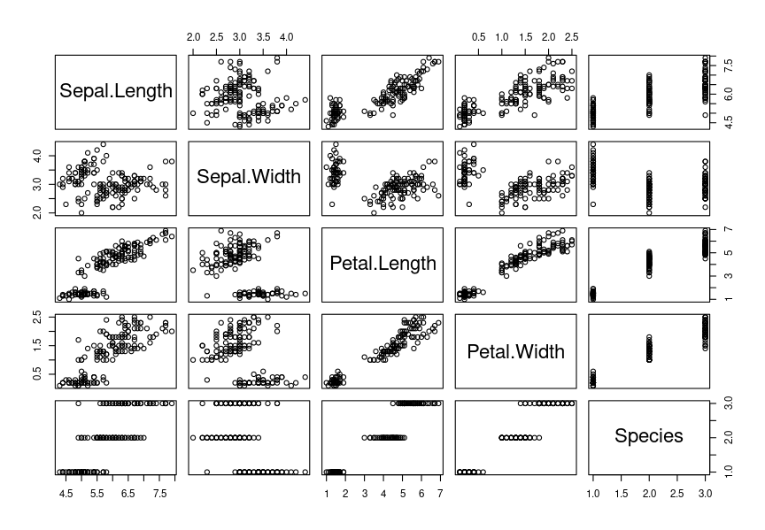
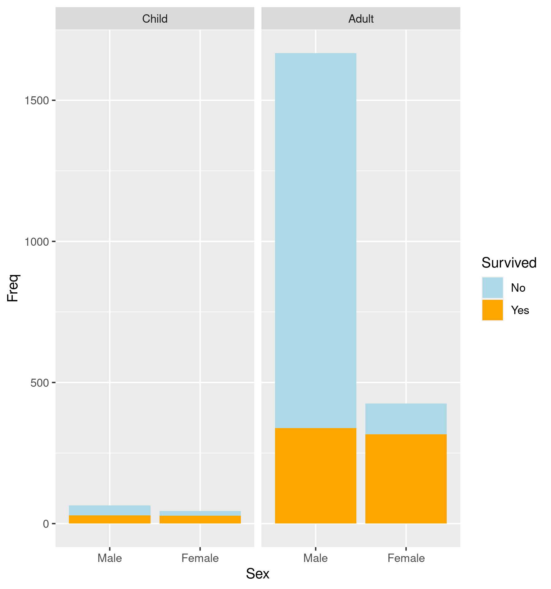
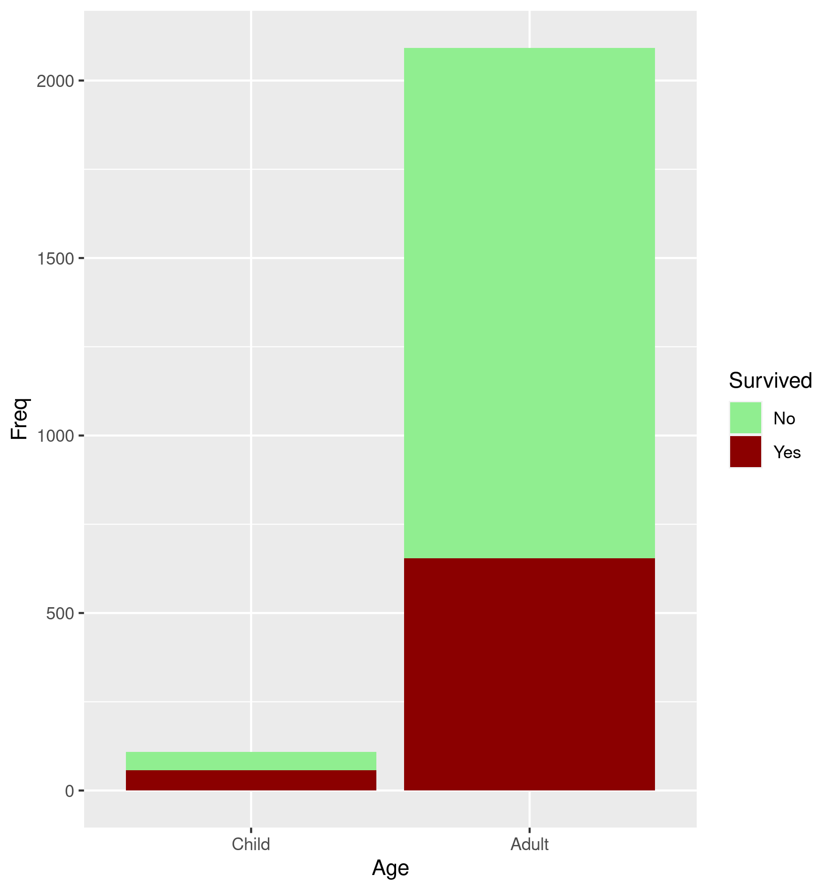
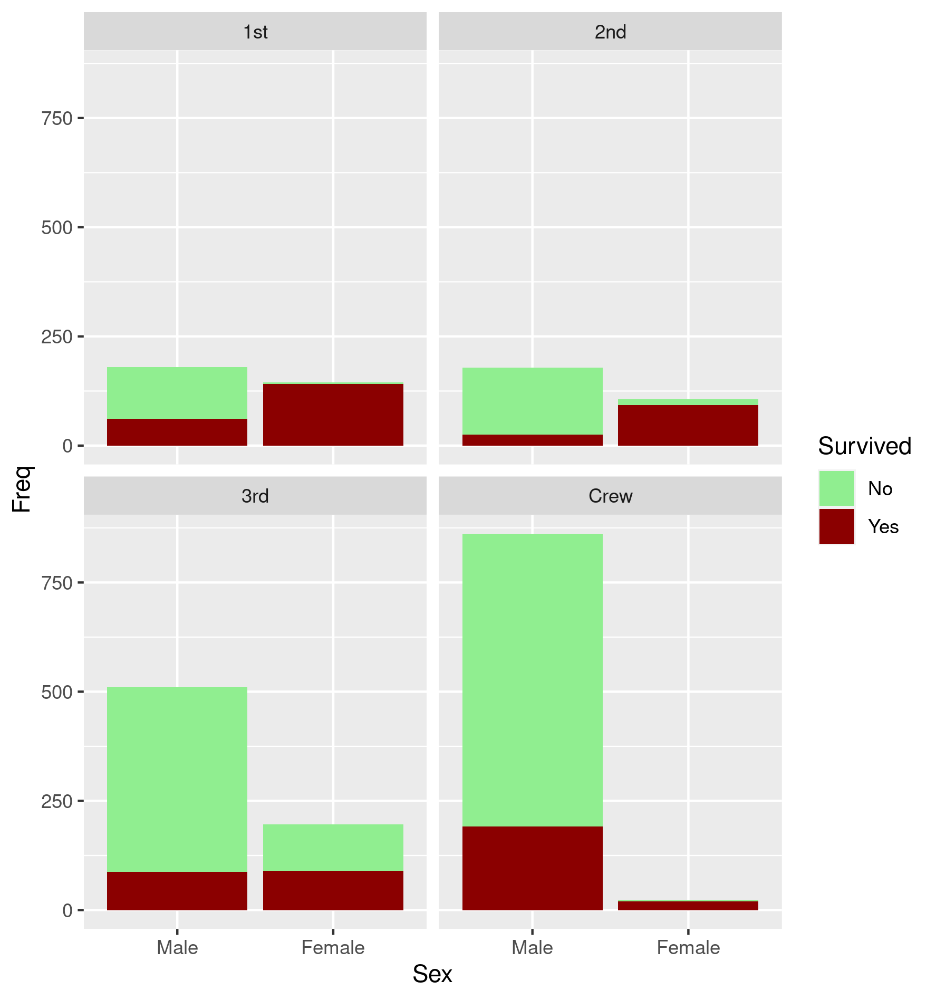

new folder in Day8: pub_data_1
```
(anvio-7.1) [sunam232@caucluster2 pub_data_1]$ conda activate /home/sunam226/.conda/envs/reademption
(reademption) [sunam232@caucluster2 pub_data_1]$ reademption create --project_path READemption_analysis --species Methanosarcina='Methanosarcina_mazei'
```
copy raw reads from day 7 to input in Day8

download data
```
wget -O READemption_analysis/input/Methanosarcina_reference_sequences/GCF_000007065.1_ASM706v1_genomic.fna.gz https://ftp.ncbi.nlm.nih.gov/genomes/all/GCF/000/007/065/GCF_000007065.1_ASM706v1/GCF_000007065.1_ASM706v1_genomic.fna.gz
gunzip READemption_analysis/input/Methanosarcina_reference_sequences/GCF_000007065.1_ASM706v1_genomic.fna.gz
mv READemption_analysis/input/Methanosarcina_reference_sequences/GCF_000007065.1_ASM706v1_genomic.fna READemption_analysis/input/Methanosarcina_reference_sequences/GCF_000007065.1_ASM706v1_genomic.fa
#download annotations
wget -P READemption_analysis/input/Methanosarcina_annotations https://ftp.ncbi.nlm.nih.gov/genomes/all/GCF/000/007/065/GCF_000007065.1_ASM706v1/GCF_000007065.1_ASM706v1_genomic.gff.gz
gunzip READemption_analysis/input/Methanosarcina_annotations/GCF_000007065.1_ASM706v1_genomic.gff.gz

# modify header of the sequence file
sed -i "s/>/>NC_003901.1 /" READemption_analysis/input/Methanosarcina_reference_sequences/GCF_000007065.1_ASM706v1_genomic.fa
```
```
sbatch pup_data.batch
```
Script
```
#!/bin/bash
#SBATCH --job-name=pub_data
#SBATCH --output=pub_data.out
#SBATCH --error=pub_data.err
#SBATCH --nodes=1
#SBATCH --ntasks-per-node=1
#SBATCH --cpus-per-task=8
#SBATCH --mem=16G
#SBATCH	--qos=long
#SBATCH --time=0-05:00:00
#SBATCH --partition=all
#SBATCH --reservation=biol217

source ~/.bashrc

module load miniconda3/4.7.12.1
module load python/3.7.4
conda activate /home/sunam226/.conda/envs/reademption
################################### ---CALCULATIONS---
#aligning:
reademption align --fastq -f READemption_analysis --poly_a_clipping --min_read_length 12 --segemehl_accuracy 95  

# coverage:
reademption coverage -p 4 --project_path READemption_analysis 

#gene wise quanty:
reademption gene_quanti -p 4 --features CDS,tRNA,rRNA --project_path READemption_analysis 

#differential gene expression:
reademption deseq -l RNA_R1.fa,RNA_R2.fa,wt_R1.fa,wt_R2.fa -c RNA,RNA,wt,wt \
	-r 1,2,1,2 --libs_by_species Methanosarcina=RNA_R1,RNA_R2,wt_R1,wt_R2 --project_path READemption_analysis

############################## ---PLOTS---
reademption viz_align --project_path READemption_analysis
reademption viz_gene_quanti --project_path READemption_analysis
reademption viz_deseq --project_path READemption_analysis
conda deactivate
jobinfo
```


### R Studio

Question to answer: how to convert a table

```
# calculator----
2+4
# help-----
?ggplot
# show pathway------
getwd()
# set working directory-------
setwd()
# create new folder-----
dir.create('data')
# create new folder in first folder-----
dir.create('data/raw_data')
# list files in folder-----
list.files

# create variable------
x = 2+2
# create variable: better solution-----
x <- 2+2

# find out class-------
x <- -5 # numeric
class(x)

x <- "Hello World" # character
class(x)

x <- TRUE # logical
class(x)

x <- 1+2i # complex
class(x)

x <- charToRaw("Hello World") # raw
class(x)

x <- data.frame(matrix(1:6, nrow = 2, ncol = 3)) # data.frame
class(x)

# operators-----------
# == for "the same" = for variables
# objects-----
data()
data("iris")
class(iris$Species)
# plots----
plot(iris)
boxplot(data=iris, x = iris$Petal.Length)
boxplot(data=iris, iris$Petal.Length~iris$Species)
# packages----
install.packages('ggplot2') # install ggplot2
library(ggplot2) # activate packages
install.packages(c('readxl', 'plotly')) # install several packages at one
library(c('readxl','plotly', 'tidyverse'))
install.packages('tidyverse')


## ggplot-----
ggplot(data = iris, mapping = aes(x = Species, y = Sepal.Length)) + geom_col()
ggplot(data = iris, mapping = aes(x = Species, y = Sepal.Length, fill=Species)) + geom_boxplot()
ggplot(data = iris, mapping = aes(x = Species, y = Sepal.Length, fill=Species)) + geom_violin()
ggplot(data = iris, mapping = aes(Petal.Length, Sepal.Length, col=Species)) + geom_point()
ggplot(data = iris, mapping = aes(Petal.Length, Petal.Width, shape=Species, col=Species, size=Species)) + geom_point()

# diagram for plot design: search in Google for: andrew abela chart guide
#save high quality plot----
plot1 <- ggplot(data = iris, mapping = aes(x = Species, y = Sepal.Length)) + geom_col()
plot1 + ggsave('plot1.pdf')
plot2 <- ggplot(data = iris, mapping = aes(Petal.Length, Petal.Width, shape=Species, col=Species, size=Species)) + geom_point()
plot2 + ggsave('plot2.tiff', height = 6, width = 8, units = 'in', dpi = 300, compression= 'lzw')
plot2 + ggsave('plot2.svg', height = 6, width = 8, units = 'in', dpi = 300, compression= 'lzw')
# units: Einheit
# dpi: resolution
# compression: high quality but less file size

# tables----

#? tidyr::spread(pollution, size, amount)
#? tidyr::spread(iris, Species, )


# training-----
# is the data normal?
hist(iris$Sepal.Length)
hist(iris$Sepal.Width) # yes
hist(iris$Petal.Length)
hist(iris$Petal.Width)

boxplot(iris$Sepal.Length)

boxplot(iris$Sepal.Width)


#titanic----
data('Titanic')
View(Titanic)
 
ggplot(data.frame(Titanic), mapping = aes(x = Class, y = Freq, fill=Survived )) + geom_col()
plot_titanic_classes <-ggplot(data.frame(Titanic), mapping = aes(x = Class, y = Freq, fill=Survived )) + geom_col()
plot_titanic_classes + ggsave('plot_titanic_classes.pdf')


ggplot(data.frame(Titanic), mapping = aes(x = Class, y = Freq fill = Survived )) + geom_bar(position = 'fill')


ggplot(data.frame(Titanic), mapping = aes (x = Sex, y = Freq, fill = Survived )) + geom_col() + scale_fill_manual(values = alpha(c('lightgreen', 'darkred')))
plot_titanic_sex <- ggplot(data.frame(Titanic), mapping = aes (x = Sex, y = Freq, fill = Survived )) + geom_col() + scale_fill_manual(values = alpha(c('lightgreen', 'darkred')))
plot_titanic_sex + ggsave('plot_titanic_sex.png')


ggplot(data.frame(Titanic), mapping = aes (x = Age, y = Freq, fill = Survived )) + geom_col() + scale_fill_manual(values = alpha(c('lightgreen', 'darkred')))
plot_titanic_age <- ggplot(data.frame(Titanic), mapping = aes (x = Age, y = Freq, fill = Survived )) + geom_col() + scale_fill_manual(values = alpha(c('lightgreen', 'darkred')))
plot_titanic_age + ggsave('plot_titanic_age.png')

ggplot(data.frame(Titanic), mapping = aes (x = Sex, y = Freq, fill = Survived )) + geom_col() + facet_wrap(~Class) + scale_fill_manual(values = alpha(c('lightgreen', 'darkred')))
plot_titanic_class_sex <- ggplot(data.frame(Titanic), mapping = aes (x = Sex, y = Freq, fill = Survived )) + geom_col() + facet_wrap(~Class) + scale_fill_manual(values = alpha(c('lightgreen', 'darkred')))
plot_titanic_class_sex + ggsave('plot_titanic_class_sex.png')

ggplot(data.frame(Titanic), mapping = aes (x = Sex, y = Freq, fill = Survived )) + geom_col() + facet_wrap(~Age) + scale_fill_manual(values = alpha(c('lightblue', 'orange')))
plot_titanic_age_sex <- ggplot(data.frame(Titanic), mapping = aes (x = Sex, y = Freq, fill = Survived )) + geom_col() + facet_wrap(~Age) + scale_fill_manual(values = alpha(c('lightblue', 'orange')))
plot_titanic_age_sex + ggsave('plot_titanic_age_sex.png')


# training 02

ggplot(iris, aes(Species, Petal.Length)) + geom_boxplot()

ggplot(iris, aes(Species, Petal.Length, fill = Species)) + geom_boxplot() + 
facet_wrap(~Species)

library(readr)
```





