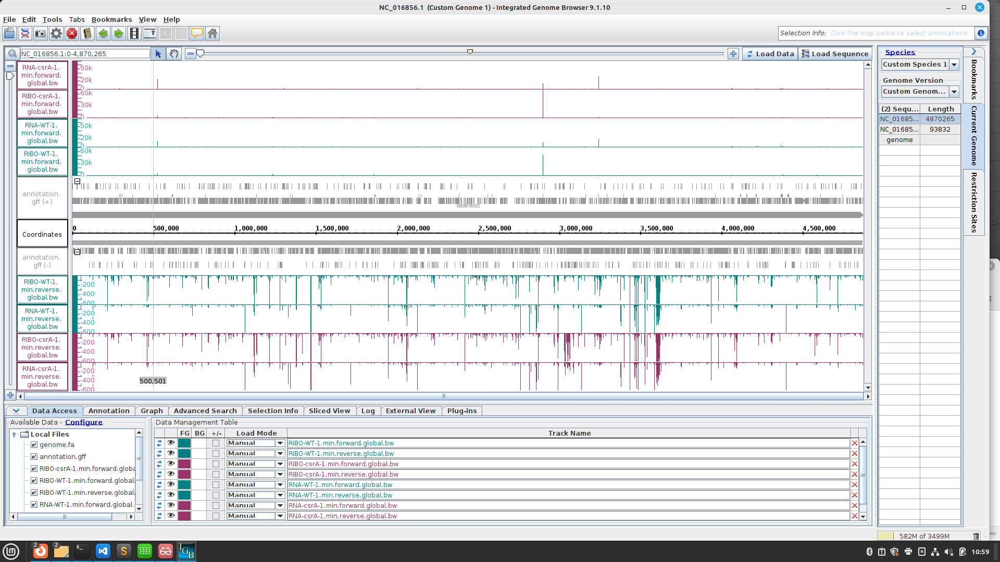
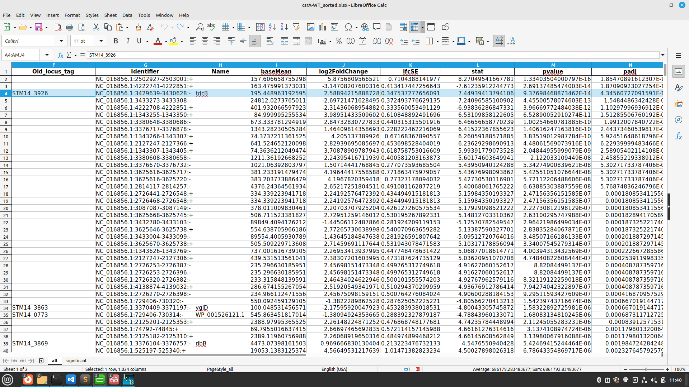
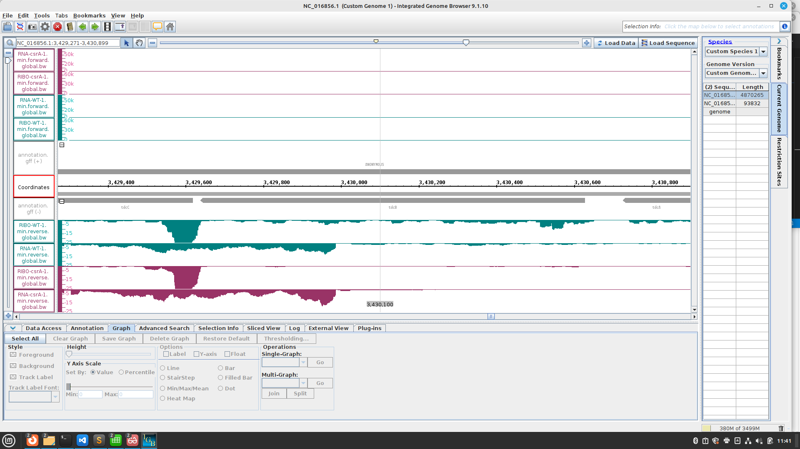
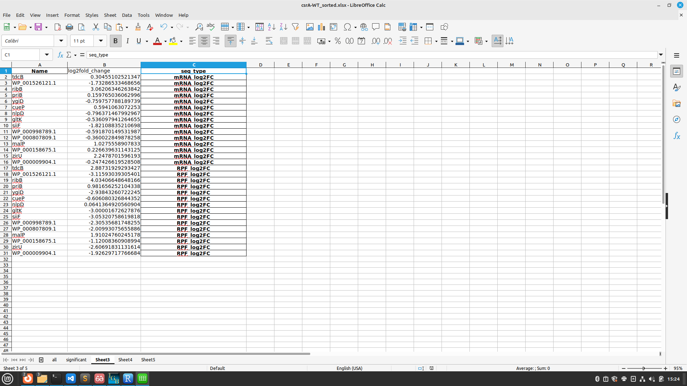
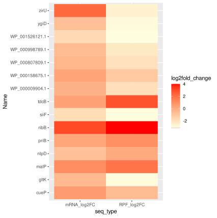
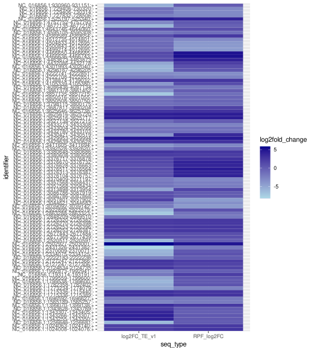
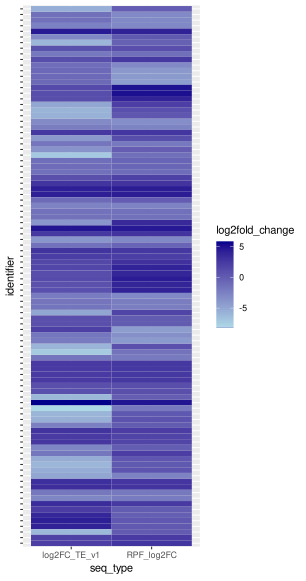

# Day 9
## Script
```
conda install -c bioconda bioconductor-deseq2 -y
conda install -c bioconda segemehl -y
conda install -c r r-gplots -y
```

## Lecture
## RNA-Seq and Ribo-Seq
- always combining both methods
- ncRNA: non coding
- always control: some genes only expressed in special conditions
- Chloramphenicol: stop translation

### HRIBO
https://hribo.readthedocs.io/en/latest/?badge=latest

## Integrated Genome Browser


Task: Find the ORF encoding csrA and some of its features
- start codon: ATG
- stop codon: TAA
- length in amino acids 61 
- SD:  AGGAG at -7
- name of the upstream gene: STM14_3413
- Is csrA translated?: Yes


search for a gene where the padj is < 0.05 (significant)
for example: tdcB




## R Studio
```
library(readxl)
df <- read_excel('csrA-WT_sorted.xlsx', sheet = 'Sheet3')
View(df)

#heatmap
ggplot(data = df, aes(x=seq_type, y=Name, fill=log2fold_change)) + geom_tile() + scale_fill_gradient(low = 'lightyellow', high = 'red', guide= 'colorbar')


shf <- read_excel('csrA-WT_sorted.xlsx', sheet = 'Sheet5')
View(shf)

ggplot(data = shf, aes(x=seq_type, y=identifier, fill=log2fold_change)) + geom_tile() + scale_fill_gradient(low = 'lightblue', high = 'darkblue', guide= 'colorbar') + theme(axis.text.y=element_blank())
# theme: remove names
```

table for rhe first heatmap 
- data rearranged from significant data
- just data with names
  



heatmap with all of the significant data 



heatmap with removed names

