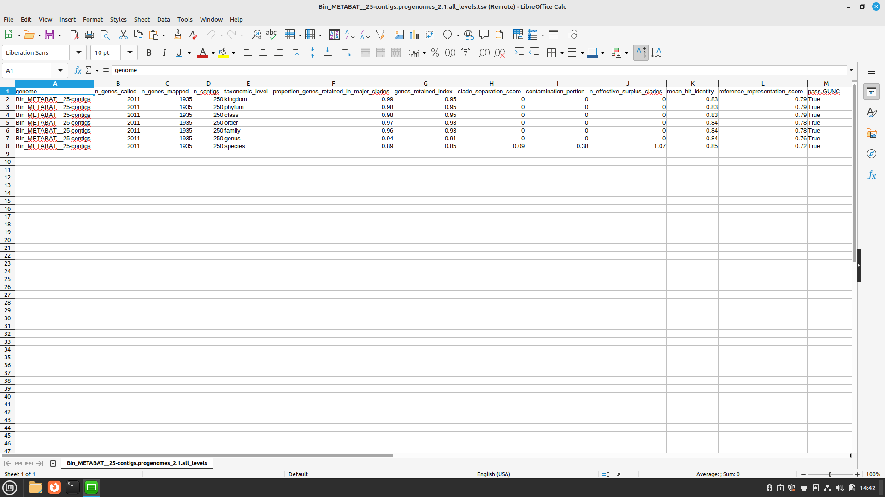

## Question

    Do you get bins that are chimeric?
    hint: look at the CSS score (explained in the lecture) and the column PASS GUNC in the tables outputs per bin in your gunc_output folder.
    In your own words (2 sentences max), explain what is a chimeric bin.

  - The METABAT data are not chimeric
  - The CONCOT data are chimeric on kingdom, phylum and class level
  - A chimeric bin contains contigs of different taxa

## Questions

Does the quality of your Archaea improve?
hint: look at completeness redundancy in the interface of anvio and submit info of before and after
Submit your output Figure
The completeness decreases from 97.37% to 93.4%. The Redundance did not change (5.3). The obvious low quality were removed, so the quality should be a little bit better. But we can not see changes in the Redundance as a marker for the quality.

## Questions

how abundant are the archaea bins in the 3 samples? (relative abundance)
**you can also use anvi-inspect -p -c, anvi-script-get-coverage-from-bam or, anvi-profile-blitz. Please look up the help page for each of those commands and construct the appropriate command line

Bin_METABAT__25:
- BGR_130305: 1.76
- BGR_130527: 1.14
- BGR_130708: 0.58

Bin_Bin_1_sub
- BGR_130305: 0.96
- BGR_130527: 0.00
- BGR_130708: 0.40

## Questions

Did you get a species assignment to the
bins previously identified?
Does the HIGH-QUALITY assignment of the bin need revision?
hint: MIMAG quality tiers

Yes at Bin_Bin_1_sub is a species level
at Bin_METABIT__25 is just genus level