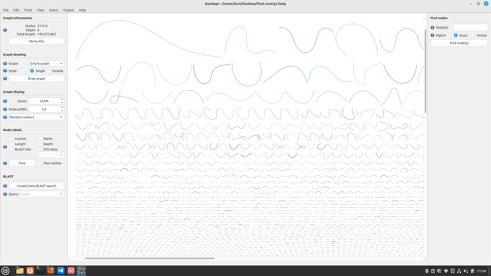
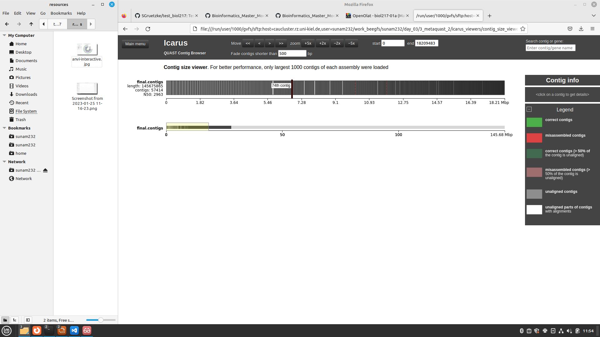

# Questions Day 2

## Question 1

    Please submit your generated figure and explain in your own words what you can see (keep it short).
    
## Answer 1
- you see the Contigs
- they are sorted by size
- you see if there are loops

## Question 1

  1. What is your N50 value? Why is this value relevant?
  2. How many contigs are assembled?
  3. What is the total length of the contigs?

1.  N50: 2963; If you line up all contigs by size, the N50 value corresponds to the length of the contig, which is half of the total length. If this value is high, it is a sign of many and long contigs. If it is low, it is a sign of many short contigs. The N50 value can therefore provide a parameter for the quality of the sample.
2.  contigs: 57414
3.  length: 145675865
