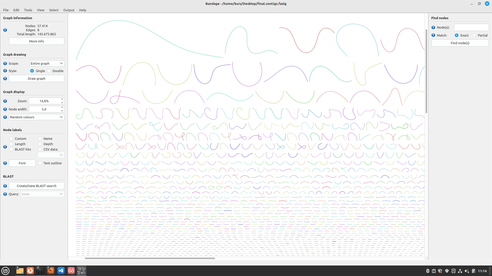
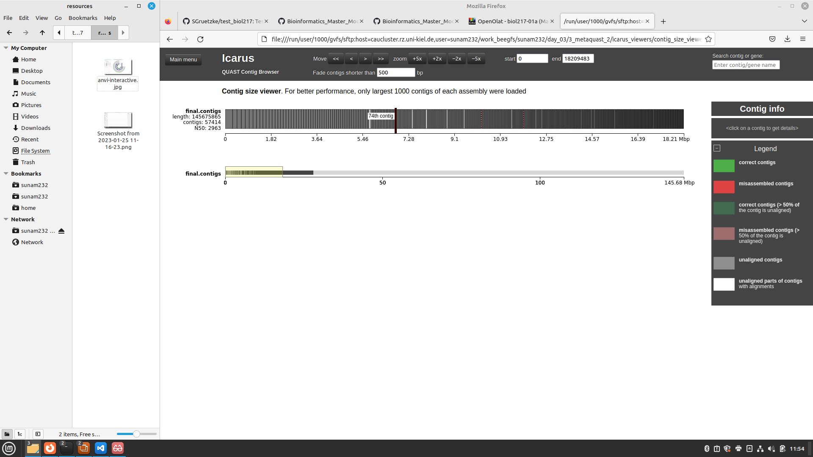

# Day 1 - Introduction to linux

- become familiar with the Linux terminal
- try some commands

current directory
```
pwd
```
list files in current directory
```
ls -l
```
create new directory
```
mkdir day_01
```
change directory
```
cd day_01
cd ../ #upwards
```
move file 
```
mv test.txt dir/day_01 
```
copy file
```
cp test02.txt day_01
```
remove directory
```
rmdir day_01
```
'*' is a wildcard. For example, if you want to copy all the text files to a directory, the command could be like this:
```
cp *.txt day_01
```
editing files
```
cat >> test.txt #command
This is a test file. #write the text
#press ctrl + C 
```
merge files
```
cat test.txt test02.txt
```
`slide 39 weiterbearbeiten`

# **Day 2 - From raw reades to contigs**

## **Data**
* samples from mesophilic agricultural biogas plant (near Cologne, Germany)
* over a time period of 587 days, monthly intervals
* by high-throughput amplicon sequencing of the archaeal and bacterial 16S rRNA genes
* https://ami-journals.onlinelibrary.wiley.com/doi/full/10.1111/1751-7915.13313
* we focused on 3 samples in the course

## **Miniconda**
needed packeges and programs were already installed into one conda environment which we activated:
 ```
module load miniconda3/4.7.12.1
conda activate anvio
 ```
 
## Quality control of raw reads
To assess the quality of the sequences, we used FastQC.
This process is very computationally intensive, which is why we did not use the Front End. In such cases, you can use the compute nodes (which have higher computing power) by using a batch script.


### **Script (fastqc)**

Every job script starts with the directive #!/bin/bash on the first line. In the next lines of the script, the job parameters are defined. These always begin with #SBATCH. Job parameters in the batch script for the quality control:
* number of nodes
* numbers of cores per task
* Real memory required per node; G for gigabytes
* walltime
* jobname
* standard output file
* standard error file
* Slurm partition (~batch class)
* use ressources reserved for course 

The job parameters are followed by the command lines for the job.
Our comand line for quality control looked like this: 
```
for i in *.gz; do fastqc $i; done
```
Since the same command was to be executed for several files, a loop was used in which fastqc was applied to all files with the .gz extension (for i in *.gz; do). -o always specifies where the newly acquired data should be stored (output folder).

```
#!/bin/bash
#SBATCH --nodes=1
#SBATCH --cpus-per-task=4
#SBATCH --mem=10G
#SBATCH --time=1:00:00
#SBATCH --job-name=fastqc
#SBATCH --output=anviscript.out
#SBATCH --error=anviscript.err
#SBATCH --partition=all
#SBATCH --reservation=biol217


for i in *.gz; do fastqc $i; done

```
To start the script, enter the following command into the terminal:
```
sbatch fastqc
```

### **Script (fastp)**
Process the reads with fastp using different parameters.
* -t trim tail 1, default is 0, here 6 bases are trimmed
* -q 20 reads with a phred score of <=20 are trimmed


As we have paired end readings we need to specify two different inputs (-i) for R1 and R2 files.
-o always specifies where the newly acquired data should be stored (output folder).

```
#!/bin/bash
#SBATCH --nodes=1
#SBATCH --cpus-per-task=4
#SBATCH --mem=10G
#SBATCH --time=1:00:00
#SBATCH --job-name=fastp
#SBATCH --output=fastp.out
#SBATCH --error=fastp.err
#SBATCH --partition=all
#SBATCH --reservation=biol217


#fastp
cd /work_beegfs/sunam232/day_02
mkdir ../clean_reads

for i in `ls *_R1.fastq.gz`;
do
    second=`echo ${i} | sed 's/_R1/_R2/g'`
    fastp -i ${i} -I ${second} -R _report -o ../clean_reads/"${i}" -O ../clean_reads/"${second}" -t 6 -q 20

done
```


# **Day 3 - From raw reads to contigs**

### **folder structure**
in the beginning we created a new folder structure for the following days:


```
ssh -X sunam232@caucluster.rz.uni-kiel.de
cd $WORK
mkdir day_03
cd ./day_03
mkdir 3_assembly
mkdir 3_metaquast
mkdir 4_mapping
mkdir 5_anvio-profiles
cp -r /home/sunam226/Day3/* /work_beegfs/sunam232/day_03
conda activate /home/sunam226/.conda/envs/anvio
cd ./3_coassembly/
```

To count the number of countigs in our final assembly file.

```
grep -c ">" final.contigs.fa
```


## Assembly Visualisation in Bandage

We use our fastp processed data and perform genome assemblies using megahit (an ultra-fast and memory-efficient Next Generation Sequencing assembler, optimized for metagenomes).

### **Script (megahit)**
We do a coassembly (multiple samples).
* -1 path to R1 file
* -2 path to R2 file, for paired end readings only


```
#!/bin/bash
#SBATCH --nodes=1
#SBATCH --cpus-per-task=4
#SBATCH --mem=10G
#SBATCH --time=1:00:00
#SBATCH --job-name=fastp
#SBATCH --output=fastp.out
#SBATCH --error=fastp.err
#SBATCH --partition=all
#SBATCH --reservation=biol217


#megahit

cd /work_beegfs/sunam232/day_02/clean

                                       
megahit -1 BGR_130305_R1.fastq.gz -1 BGR_130527_R1.fastq.gz -1 BGR_130708_R1.fastq.gz -2 BGR_130305_R2.fastq.gz -2 BGR_130527_R2.fastq.gz -2 BGR_130708_R2.fastq.gz --min-contig-len 1000 --presets meta-large -m 0.85 -o /work_beegfs/sunam232/day_02/assembly -t 20                      

```

Now we had the contigs. To visualize them in Bandage we had to change the format from fa to fastg:
```
megahit_toolkit contig2fastg 99 final.contigs.fa > final.contigs.fastg                   
```
Then the FASTG file k99.fastg can be loaded into Bandage.

#### Question 1

Please submit your generated figure and explain in your own words what you can see (keep it short).
    
#### Answer 1
- you see the Contigs
- they are sorted by size
- you see if there are loops



```
megahit_toolkit contig2fastg 99 final.contigs.fa > final.contigs.fastg
```

## Quality Assesment of Assemblies
* we used QUAST (QUality ASsessment Tool) to evaluate results from megahit.
* our batch script to run quast did not work (`metaquast -t 6 -o /work_beegfs/sunam232/day_03/3_metaquast -m 1000 final.contigs.fa`)
* we copied the data (`cp -r /home/sunam226/Day3/3_metaquast_out/* /work_beegfs/sunam232/day_03/3_metaquast_2`)
* opened the html file in firefox.

#### Question 2

  1. What is your N50 value? Why is this value relevant?
  2. How many contigs are assembled?
  3. What is the total length of the contigs?

#### Answer 2



1.  N50: 2963; If you line up all contigs by size, the N50 value corresponds to the length of the contig, which is half of the total length. If this value is high, it is a sign of many and long contigs. If it is low, it is a sign of many short contigs. The N50 value can therefore provide a parameter for the quality of the sample.
2.  contigs: 57414
3.  length: 145675865


## Genomes Binning

* format contigs and clean reads so that the data can be processed later by Anvio:

```
anvi-script-reformat-fasta final.contigs.fa -o /work_beegfs/sunam232/day_03/3_metaquast_2/contigs.anvio.fa --min-len 1000 --simplify-names --report-file name_conversion.txt
```

### Mapping

* map raw reads onto assembled contigs
* with bowtie2. 
* first index our mapping reference fasta file (batch script): 
```
#!/bin/bash
#SBATCH --nodes=1
#SBATCH --cpus-per-task=4
#SBATCH --mem=10G
#SBATCH --time=1:00:00
#SBATCH --job-name=bowtie
#SBATCH --output=bowtie.out
#SBATCH --error=bowtie.err
#SBATCH --partition=all
#SBATCH --reservation=biol217

module load bowtie2
bowtie2-build contigs.anvio.fa contigs.anvio.fa.index
```
now mapping with bowtie2:

### **Script (mapping)**
* -1 R1 fasta file containing the raw reads after fastp processing
* -2 R2 fasta file containing the raw reads after fastp processing
* -S name of the output file
```
#!/bin/bash
#SBATCH --nodes=1
#SBATCH --cpus-per-task=4
#SBATCH --mem=10G
#SBATCH --time=1:00:00
#SBATCH --job-name=mapping
#SBATCH --output=mapping.out
#SBATCH --error=mapping.err
#SBATCH --partition=all
#SBATCH --reservation=biol217

module load bowtie2
cd /work_beegfs/sunam232/day_03/3_metaquast_2/
for i in `ls *_R1.fastq.gz`;
do
    second=`echo ${i} | sed 's/_R1/_R2/g'`
    echo bowtie2 --very-fast -x /work_beegfs/sunam232/day_03/3_metaquast_2/index -1 ${i} -2 ${second} -S /work_beegfs/sunam232/day_03/4_mapping/"$i".sam 
done
```

since the process has broken down, we have downloaded the data
```
cp -r /home/sunam226/Day3/4_mapping /work_beegfs/sunam232/day_03/4_mapping
```
* Now we had sequence mapping files (SAM) with the .sam extension
* next step: convert to binary alignment and map (BAM) file with the .bam extension using samtools:

### **Script (samtools)**
```
#!/bin/bash
#SBATCH --nodes=1
#SBATCH --cpus-per-task=4
#SBATCH --mem=10G
#SBATCH --time=1:00:00
#SBATCH --job-name=samtools
#SBATCH --output=samtools.out
#SBATCH --error=samtools.err
#SBATCH --partition=all
#SBATCH --reservation=biol217

module load samtools

cd /work_beegfs/sunam232/day_03/4_mapping/
for i in *.sam; do samtools view -bS $i > "$i".bam; done
```


# **Day 4 - From bins to species and abundance estimation**

### Contigs data preparation

We used contigs database (contigs-db):
* is an anvi’o database that contains key information associated with the sequences
* can store additional information about the sequences in it and others can query and use it


### **Script (contigs-db)**
with this command, anvi-gen-contigs-database will
* Compute k-mer frequencies for each contig
* Soft-split contigs longer than 20,000 bp into smaller ones
* Identify open reading frames using Prodigal, the bacterial and archaeal gene finding program


```
#!/bin/bash
#SBATCH --nodes=1
#SBATCH --cpus-per-task=4
#SBATCH --mem=10G
#SBATCH --time=1:00:00
#SBATCH --job-name=anvio
#SBATCH --output=anvio_out
#SBATCH --error=anvio.err
#SBATCH --partition=all
#SBATCH --reservation=biol217


conda activate /home/sunam225/miniconda3/miniconda4.9.2/usr/etc/profile.d/conda.sh/envs/anvio-7.1

anvi-gen-contigs-database -f /work_beegfs/sunam232/day_03/4_mapping/contigs.anvio.fa -o contigs.db -n 'biol217'

```
Then we performed an HMM search on our contigs
* Hidden Markov Models (HMMs) are used to search for specific genes with known functions in a larger dataset
* program that will do a search for HMMs against a contigs-db and store that information into the contigs-db’s hmm-hits

### **Script (hmm)**

* utilize multiple default bacterial single-copy core gene collections and identify hits among our genes to those collections

```
#!/bin/bash
#SBATCH --nodes=1
#SBATCH --cpus-per-task=4
#SBATCH --mem=10G
#SBATCH --time=1:00:00
#SBATCH --job-name=hmm
#SBATCH --output=hmm_out
#SBATCH --error=hmm.err
#SBATCH --partition=all
#SBATCH --reservation=biol217


anvi-run-hmms -c /work_beegfs/sunam232/day_04/contigs.db
```

Now we had our contigs database ready, and the HMMs. We had a quick look at it using the program anvi-display-contigs-stats. For this we needed anvi'o interactive:

```
srun --reservation=biol217 --pty --mem=10G --nodes=1 --tasks-per-node=1 --cpus-per-task=1 --partition=all /bin/bash
conda activate /home/sunam225/miniconda3/miniconda4.9.2/usr/etc/profile.d/conda.sh/envs/anvio-7.1
anvi-display-contigs-stats contigs.db
```
Open new terminal
```
ssh -L 8060:localhost:8080 sunam323@caucluster-old.rz.uni-kiel.de
ssh -L 8080:localhost:8080 node'010

```

Firefox

```
http://127.0.0.1:8060
```
close second terminal
logout from node


### Binning with ANVI'O


* sort and index .bam files.
* anvi’o does this by using samtools in the background, it merges two separate samtools commands (sorting and indexing = for each .bam file, there also is a .bam.bai file in the same directory) into one

### **Script (anvio_samtools)**

```
#!/bin/bash
#SBATCH --nodes=1
#SBATCH --cpus-per-task=4
#SBATCH --mem=10G
#SBATCH --time=1:00:00
#SBATCH --job-name=anvio_samtools
#SBATCH --output=anvio_samtools_out
#SBATCH --error=anvio_samtools.err
#SBATCH --partition=all
#SBATCH --reservation=biol217

cd /work_beegfs/sunam232/day_03/4_mapping/4_mapping/

for i in *.bam; do anvi-init-bam $i -o /work_beegfs/sunam232/day_03/5_anvio-profiles/"$i".sorted.bam; done

```

### Preperation for actual binning
An anvi’o profile stores sample-specific information about contigs. Profiling a BAM file with anvi’o using anvi-profile creates a single profile that reports properties for each contig in a single sample based on mapping results.

Anvio's profile will:
* Process each contig that is longer than 2,500 nts by default

Processing of contigs will include:
* The recovery of mean coverage, standard deviation of coverage, and the average coverage for the inner quartiles (Q1 and Q3) for a given contig.
* The characterization of single-nucleotide variants (SNVs) for every nucleotide position. By default, the profiler will not pay attention to any nucleotide position with less than 10X coverage.
* Finally, because single profiles are rarely used for genome binning or visualization, and since the clustering step increases the profiling runtime for no good reason, the default behavior of profiling is to not cluster contigs automatically.


### **Script (anvio_profiles)**

```
#!/bin/bash
#SBATCH --nodes=1
#SBATCH --cpus-per-task=4
#SBATCH --mem=10G
#SBATCH --time=1:00:00
#SBATCH --job-name=anvio_profiles
#SBATCH --output=anvio_profiles_out
#SBATCH --error=anvio_profiles.err
#SBATCH --partition=all
#SBATCH --reservation=biol217

cd /work_beegfs/sunam232/day_03/5_anvio-profiles/
mkdir /work_beegfs/sunam232/day_03/5_anvio-profiles/profiling/
for i in `ls *.sorted.bam | cut -d "." -f 1`; do anvi-profile -i "$i".bam.sorted.bam -c contigs.db -o /work_beegfs/sunam232/day_03/5_anvio-profiles/profiling/”$i”; done
```


