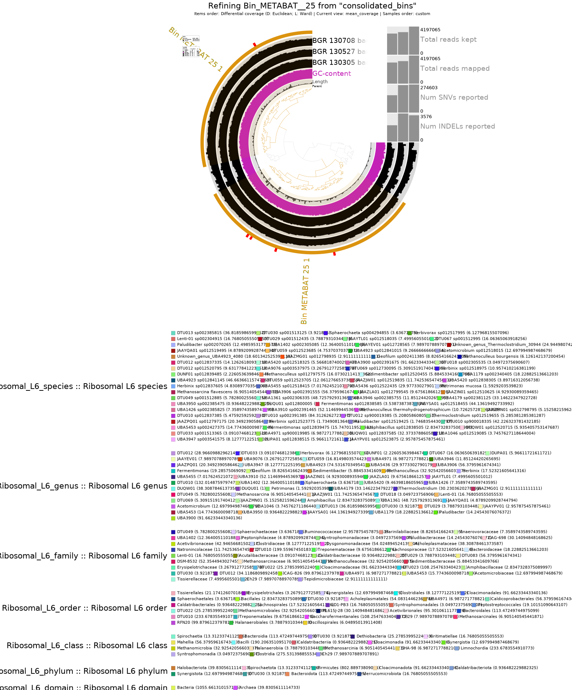
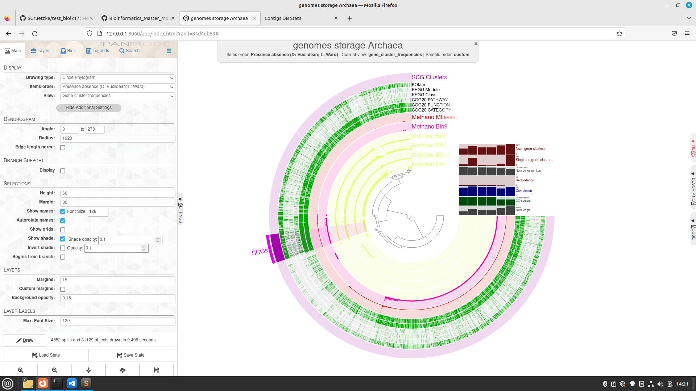
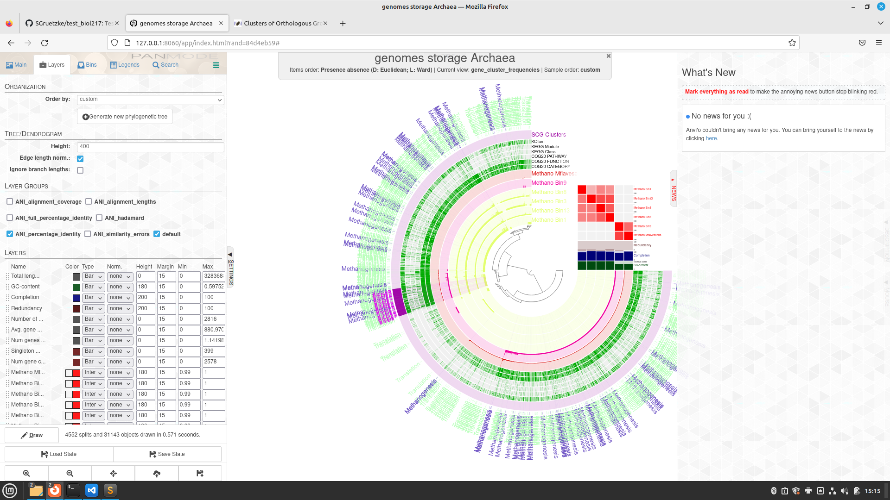
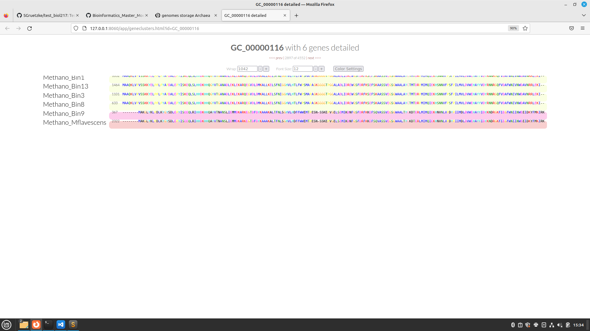
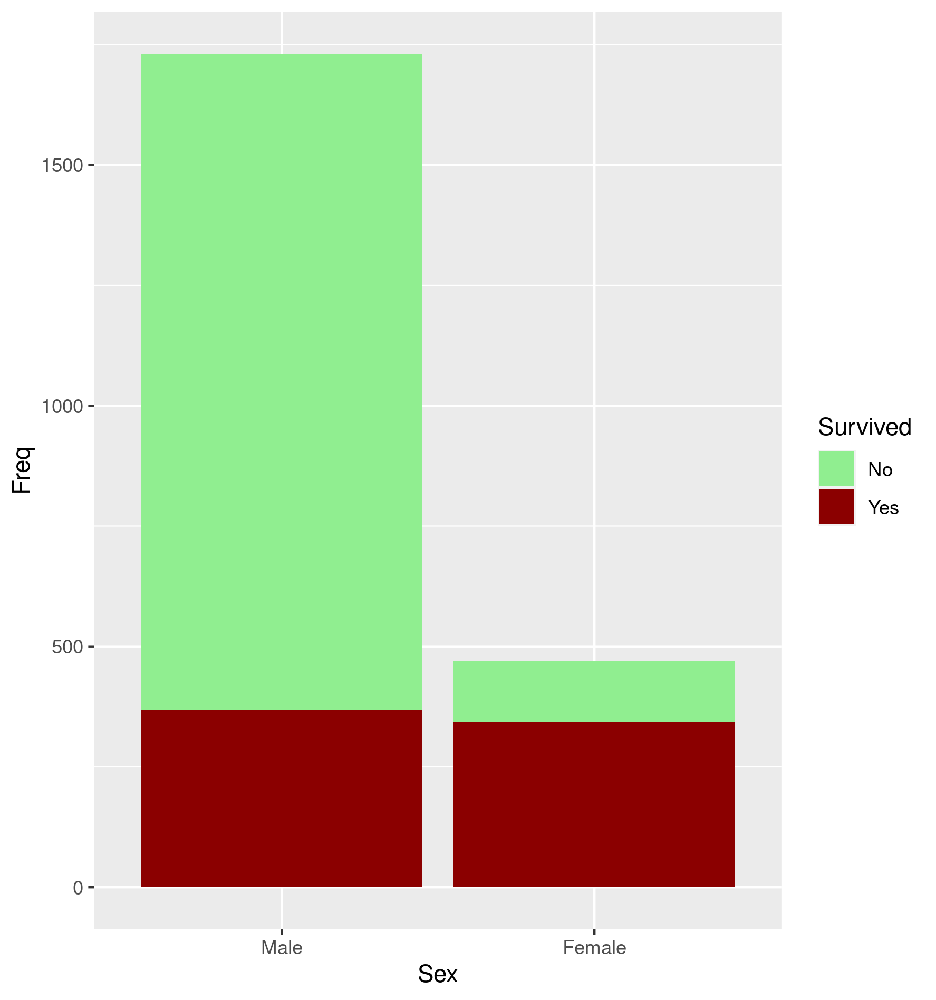
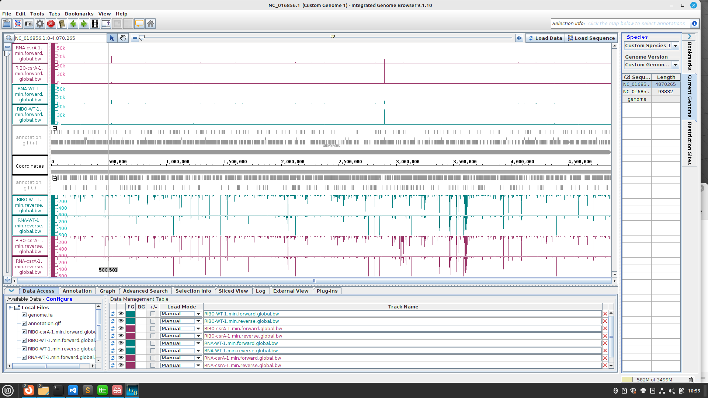
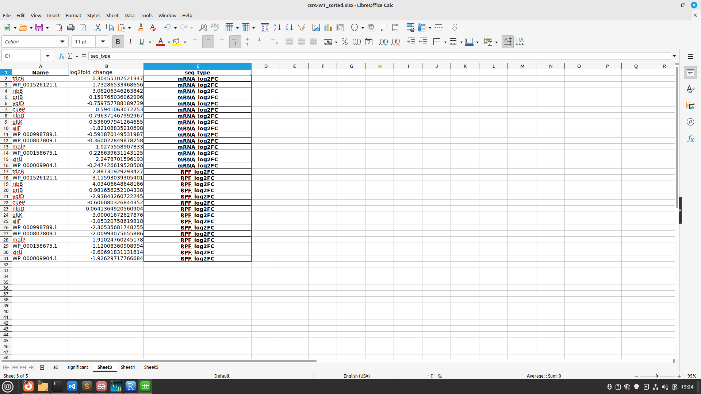
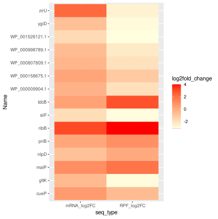
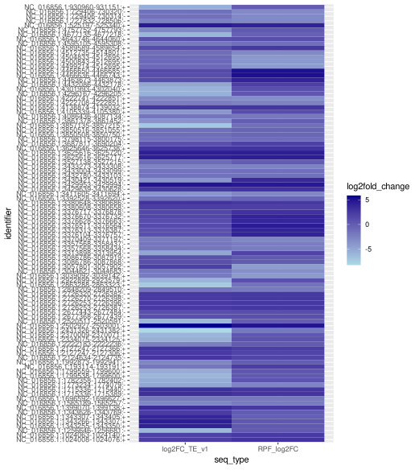

# Day 1 - Introduction to linux

- become familiar with the Linux terminal
- try some commands

current directory
```
pwd
```
list files in current directory
```
ls -l
```
create new directory
```
mkdir day_01
```
change directory
```
cd day_01
cd ../ #upwards
```
move file 
```
mv test.txt dir/day_01 
```
copy file
```
cp test02.txt day_01
```
remove directory
```
rmdir day_01
```
'*' is a wildcard. For example, if you want to copy all the text files to a directory, the command could be like this:
```
cp *.txt day_01
```
editing files
```
cat >> test.txt #command
This is a test file. #write the text
#press ctrl + C 
```
merge files
```
cat test.txt test02.txt
```
`slide 39 weiterbearbeiten`

# **Day 2 - From raw reades to contigs**

## **Data**
* samples from mesophilic agricultural biogas plant (near Cologne, Germany)
* over a time period of 587 days, monthly intervals
* by high-throughput amplicon sequencing of the archaeal and bacterial 16S rRNA genes
* https://ami-journals.onlinelibrary.wiley.com/doi/full/10.1111/1751-7915.13313
* we focused on 3 samples in the course

## **Miniconda**
needed packeges and programs were already installed into one conda environment which we activated:
 ```
module load miniconda3/4.7.12.1
conda activate anvio
 ```
 
## Quality control of raw reads
To assess the quality of the sequences, we used FastQC.
This process is very computationally intensive, which is why we did not use the Front End. In such cases, you can use the compute nodes (which have higher computing power) by using a batch script.


### **Script (fastqc)**

Every job script starts with the directive #!/bin/bash on the first line. In the next lines of the script, the job parameters are defined. These always begin with #SBATCH. Job parameters in the batch script for the quality control:
* number of nodes
* numbers of cores per task
* Real memory required per node; G for gigabytes
* walltime
* jobname
* standard output file
* standard error file
* Slurm partition (~batch class)
* use ressources reserved for course 

The job parameters are followed by the command lines for the job.
Our comand line for quality control looked like this: 
```
for i in *.gz; do fastqc $i; done
```
Since the same command was to be executed for several files, a loop was used in which fastqc was applied to all files with the .gz extension (for i in *.gz; do). -o always specifies where the newly acquired data should be stored (output folder).

```
#!/bin/bash
#SBATCH --nodes=1
#SBATCH --cpus-per-task=4
#SBATCH --mem=10G
#SBATCH --time=1:00:00
#SBATCH --job-name=fastqc
#SBATCH --output=anviscript.out
#SBATCH --error=anviscript.err
#SBATCH --partition=all
#SBATCH --reservation=biol217


for i in *.gz; do fastqc $i; done

```
To start the script, enter the following command into the terminal:
```
sbatch fastqc
```

### **Script (fastp)**
Process the reads with fastp using different parameters.
* -t trim tail 1, default is 0, here 6 bases are trimmed
* -q 20 reads with a phred score of <=20 are trimmed


As we have paired end readings we need to specify two different inputs (-i) for R1 and R2 files.
-o always specifies where the newly acquired data should be stored (output folder).

```
#!/bin/bash
#SBATCH --nodes=1
#SBATCH --cpus-per-task=4
#SBATCH --mem=10G
#SBATCH --time=1:00:00
#SBATCH --job-name=fastp
#SBATCH --output=fastp.out
#SBATCH --error=fastp.err
#SBATCH --partition=all
#SBATCH --reservation=biol217


#fastp
cd /work_beegfs/sunam232/day_02
mkdir ../clean_reads

for i in `ls *_R1.fastq.gz`;
do
    second=`echo ${i} | sed 's/_R1/_R2/g'`
    fastp -i ${i} -I ${second} -R _report -o ../clean_reads/"${i}" -O ../clean_reads/"${second}" -t 6 -q 20

done
```


# **Day 3 - From raw reads to contigs**

### **folder structure**
in the beginning we created a new folder structure for the following days:


```
ssh -X sunam232@caucluster.rz.uni-kiel.de
cd $WORK
mkdir day_03
cd ./day_03
mkdir 3_assembly
mkdir 3_metaquast
mkdir 4_mapping
mkdir 5_anvio-profiles
cp -r /home/sunam226/Day3/* /work_beegfs/sunam232/day_03
conda activate /home/sunam226/.conda/envs/anvio
cd ./3_coassembly/
```

To count the number of countigs in our final assembly file.

```
grep -c ">" final.contigs.fa
```


## Assembly Visualisation in Bandage

We use our fastp processed data and perform genome assemblies using megahit (an ultra-fast and memory-efficient Next Generation Sequencing assembler, optimized for metagenomes).

### **Script (megahit)**
We do a coassembly (multiple samples).
* -1 path to R1 file
* -2 path to R2 file, for paired end readings only


```
#!/bin/bash
#SBATCH --nodes=1
#SBATCH --cpus-per-task=4
#SBATCH --mem=10G
#SBATCH --time=1:00:00
#SBATCH --job-name=fastp
#SBATCH --output=fastp.out
#SBATCH --error=fastp.err
#SBATCH --partition=all
#SBATCH --reservation=biol217


#megahit

cd /work_beegfs/sunam232/day_02/clean

                                       
megahit -1 BGR_130305_R1.fastq.gz -1 BGR_130527_R1.fastq.gz -1 BGR_130708_R1.fastq.gz -2 BGR_130305_R2.fastq.gz -2 BGR_130527_R2.fastq.gz -2 BGR_130708_R2.fastq.gz --min-contig-len 1000 --presets meta-large -m 0.85 -o /work_beegfs/sunam232/day_02/assembly -t 20                      

```

Now we had the contigs. To visualize them in Bandage we had to change the format from fa to fastg:
```
megahit_toolkit contig2fastg 99 final.contigs.fa > final.contigs.fastg                   
```
Then the FASTG file k99.fastg can be loaded into Bandage.

#### Question 1

Please submit your generated figure and explain in your own words what you can see (keep it short).
    
#### Answer 1
- you see the Contigs
- they are sorted by size
- you see if there are loops


```
megahit_toolkit contig2fastg 99 final.contigs.fa > final.contigs.fastg
```

## Quality Assesment of Assemblies
* we used QUAST (QUality ASsessment Tool) to evaluate results from megahit.
* our batch script to run quast did not work (`metaquast -t 6 -o /work_beegfs/sunam232/day_03/3_metaquast -m 1000 final.contigs.fa`)
* we copied the data (`cp -r /home/sunam226/Day3/3_metaquast_out/* /work_beegfs/sunam232/day_03/3_metaquast_2`)
* opened the html file in firefox.

#### Question 2

  1. What is your N50 value? Why is this value relevant?
  2. How many contigs are assembled?
  3. What is the total length of the contigs?

#### Answer 2


1.  N50: 2963; If you line up all contigs by size, the N50 value corresponds to the length of the contig, which is half of the total length. If this value is high, it is a sign of many and long contigs. If it is low, it is a sign of many short contigs. The N50 value can therefore provide a parameter for the quality of the sample.
2.  contigs: 57414
3.  length: 145675865


## Genomes Binning

* format contigs and clean reads so that the data can be processed later by Anvio:

```
anvi-script-reformat-fasta final.contigs.fa -o /work_beegfs/sunam232/day_03/3_metaquast_2/contigs.anvio.fa --min-len 1000 --simplify-names --report-file name_conversion.txt
```

### Mapping

* map raw reads onto assembled contigs
* with bowtie2. 
* first index our mapping reference fasta file (batch script): 
```
#!/bin/bash
#SBATCH --nodes=1
#SBATCH --cpus-per-task=4
#SBATCH --mem=10G
#SBATCH --time=1:00:00
#SBATCH --job-name=bowtie
#SBATCH --output=bowtie.out
#SBATCH --error=bowtie.err
#SBATCH --partition=all
#SBATCH --reservation=biol217

module load bowtie2
bowtie2-build contigs.anvio.fa contigs.anvio.fa.index
```
now mapping with bowtie2:

### **Script (mapping)**
* -1 R1 fasta file containing the raw reads after fastp processing
* -2 R2 fasta file containing the raw reads after fastp processing
* -S name of the output file
```
#!/bin/bash
#SBATCH --nodes=1
#SBATCH --cpus-per-task=4
#SBATCH --mem=10G
#SBATCH --time=1:00:00
#SBATCH --job-name=mapping
#SBATCH --output=mapping.out
#SBATCH --error=mapping.err
#SBATCH --partition=all
#SBATCH --reservation=biol217

module load bowtie2
cd /work_beegfs/sunam232/day_03/3_metaquast_2/
for i in `ls *_R1.fastq.gz`;
do
    second=`echo ${i} | sed 's/_R1/_R2/g'`
    echo bowtie2 --very-fast -x /work_beegfs/sunam232/day_03/3_metaquast_2/index -1 ${i} -2 ${second} -S /work_beegfs/sunam232/day_03/4_mapping/"$i".sam 
done
```

since the process has broken down, we have downloaded the data
```
cp -r /home/sunam226/Day3/4_mapping /work_beegfs/sunam232/day_03/4_mapping
```
* Now we had sequence mapping files (SAM) with the .sam extension
* next step: convert to binary alignment and map (BAM) file with the .bam extension using samtools:

### **Script (samtools)**
```
#!/bin/bash
#SBATCH --nodes=1
#SBATCH --cpus-per-task=4
#SBATCH --mem=10G
#SBATCH --time=1:00:00
#SBATCH --job-name=samtools
#SBATCH --output=samtools.out
#SBATCH --error=samtools.err
#SBATCH --partition=all
#SBATCH --reservation=biol217

module load samtools

cd /work_beegfs/sunam232/day_03/4_mapping/
for i in *.sam; do samtools view -bS $i > "$i".bam; done
```


# **Day 4 - From bins to species and abundance estimation**

### Contigs data preparation

We used contigs database (contigs-db):
* is an anvi’o database that contains key information associated with the sequences
* can store additional information about the sequences in it and others can query and use it


### **Script (contigs-db)**
with this command, anvi-gen-contigs-database will
* Compute k-mer frequencies for each contig
* Soft-split contigs longer than 20,000 bp into smaller ones
* Identify open reading frames using Prodigal, the bacterial and archaeal gene finding program


```
#!/bin/bash
#SBATCH --nodes=1
#SBATCH --cpus-per-task=4
#SBATCH --mem=10G
#SBATCH --time=1:00:00
#SBATCH --job-name=anvio
#SBATCH --output=anvio_out
#SBATCH --error=anvio.err
#SBATCH --partition=all
#SBATCH --reservation=biol217


conda activate /home/sunam225/miniconda3/miniconda4.9.2/usr/etc/profile.d/conda.sh/envs/anvio-7.1

anvi-gen-contigs-database -f /work_beegfs/sunam232/day_03/4_mapping/contigs.anvio.fa -o contigs.db -n 'biol217'

```
Then we performed an HMM search on our contigs
* Hidden Markov Models (HMMs) are used to search for specific genes with known functions in a larger dataset
* program that will do a search for HMMs against a contigs-db and store that information into the contigs-db’s hmm-hits

### **Script (hmm)**

* utilize multiple default bacterial single-copy core gene collections and identify hits among our genes to those collections

```
#!/bin/bash
#SBATCH --nodes=1
#SBATCH --cpus-per-task=4
#SBATCH --mem=10G
#SBATCH --time=1:00:00
#SBATCH --job-name=hmm
#SBATCH --output=hmm_out
#SBATCH --error=hmm.err
#SBATCH --partition=all
#SBATCH --reservation=biol217


anvi-run-hmms -c /work_beegfs/sunam232/day_04/contigs.db
```

Now we had our contigs database ready, and the HMMs. We had a quick look at it using the program anvi-display-contigs-stats. For this we needed anvi'o interactive:

```
srun --reservation=biol217 --pty --mem=10G --nodes=1 --tasks-per-node=1 --cpus-per-task=1 --partition=all /bin/bash
conda activate /home/sunam225/miniconda3/miniconda4.9.2/usr/etc/profile.d/conda.sh/envs/anvio-7.1
anvi-display-contigs-stats contigs.db
```
Open new terminal
```
ssh -L 8060:localhost:8080 sunam323@caucluster-old.rz.uni-kiel.de
ssh -L 8080:localhost:8080 node'010

```

Firefox

```
http://127.0.0.1:8060
```
close second terminal
logout from node


### Binning with ANVI'O


* sort and index .bam files.
* anvi’o does this by using samtools in the background, it merges two separate samtools commands (sorting and indexing = for each .bam file, there also is a .bam.bai file in the same directory) into one

### **Script (anvio_samtools)**

```
#!/bin/bash
#SBATCH --nodes=1
#SBATCH --cpus-per-task=4
#SBATCH --mem=10G
#SBATCH --time=1:00:00
#SBATCH --job-name=anvio_samtools
#SBATCH --output=anvio_samtools_out
#SBATCH --error=anvio_samtools.err
#SBATCH --partition=all
#SBATCH --reservation=biol217

cd /work_beegfs/sunam232/day_03/4_mapping/4_mapping/

for i in *.bam; do anvi-init-bam $i -o /work_beegfs/sunam232/day_03/5_anvio-profiles/"$i".sorted.bam; done

```

### Preperation for actual binning
An anvi’o profile stores sample-specific information about contigs. Profiling a BAM file with anvi’o using anvi-profile creates a single profile that reports properties for each contig in a single sample based on mapping results.

Anvio's profile will:
* Process each contig that is longer than 2,500 nts by default

Processing of contigs will include:
* The recovery of mean coverage, standard deviation of coverage, and the average coverage for the inner quartiles (Q1 and Q3) for a given contig.
* The characterization of single-nucleotide variants (SNVs) for every nucleotide position. By default, the profiler will not pay attention to any nucleotide position with less than 10X coverage.
* Finally, because single profiles are rarely used for genome binning or visualization, and since the clustering step increases the profiling runtime for no good reason, the default behavior of profiling is to not cluster contigs automatically.


### **Script (anvio_profiles)**

```
#!/bin/bash
#SBATCH --nodes=1
#SBATCH --cpus-per-task=4
#SBATCH --mem=10G
#SBATCH --time=1:00:00
#SBATCH --job-name=anvio_profiles
#SBATCH --output=anvio_profiles_out
#SBATCH --error=anvio_profiles.err
#SBATCH --partition=all
#SBATCH --reservation=biol217

cd /work_beegfs/sunam232/day_03/5_anvio-profiles/
mkdir /work_beegfs/sunam232/day_03/5_anvio-profiles/profiling/
for i in `ls *.sorted.bam | cut -d "." -f 1`; do anvi-profile -i "$i".bam.sorted.bam -c contigs.db -o /work_beegfs/sunam232/day_03/5_anvio-profiles/profiling/”$i”; done
```

### Merge the profiles coming from the different samples into one profile
With anvi-merge:
* merge everything and create a merged profile
* attempt to create multiple clusterings of the splits using the default clustering configurations


### **Script (anvio_merge)**

```
#!/bin/bash
#SBATCH --nodes=1
#SBATCH --cpus-per-task=4
#SBATCH --mem=10G
#SBATCH --time=1:00:00
#SBATCH --job-name=anvio_merge
#SBATCH --output=anvio_merge_out
#SBATCH --error=anvio_merge.err
#SBATCH --partition=all
#SBATCH --reservation=biol217


cd /work_beegfs/sunam232/day_03/5_anvio-profiles/
anvi-merge /work_beegfs/sunam232/day_03/5_anvio-profiles/5_anvio_profiles/BGR_130305/PROFILE.db /work_beegfs/sunam232/day_03/5_anvio-profiles/5_anvio_profiles/BGR_130527/PROFILE.db /work_beegfs/sunam232/day_03/5_anvio-profiles/5_anvio_profiles/BGR_130708/PROFILE.db -o /work_beegfs/sunam232/day_03/5_anvio-profiles/5_anvio_profiles/merged_profiles_02 -c /work_beegfs/sunam232/day_03/5_anvio-profiles/contigs.db --enforce-hierarchical-clustering

```

### Genome binning

* trying to group together a bunch of contigs that all belong to the same genome using various metrics like tetranucleotide frequency, differential coverage, completion,...
* we used two binners: Metabat2 and CONCOCT
* then we used DAS_Tool to choose the best bins

### **Script (metabat)**

* -p output folder from the last step/PROFILE.db file with the merged profiles
* -c contig.db folder
* -C name of the output collection that this step will create Note that this will be stored within your merged profiles and not as an extra file

```
#!/bin/bash
#SBATCH --nodes=1
#SBATCH --cpus-per-task=4
#SBATCH --mem=10G
#SBATCH --time=1:00:00
#SBATCH --job-name=metabat
#SBATCH --output=metabat_out
#SBATCH --error=metabat.err
#SBATCH --partition=all
#SBATCH --reservation=biol217


cd /work_beegfs/sunam232/day_03/5_anvio-profiles/

anvi-cluster-contigs -p /work_beegfs/sunam232/day_03/5_anvio-profiles/5_anvio_profiles/merged_profiles/PROFILE.db -c /work_beegfs/sunam232/day_03/5_anvio-profiles/contigs.db -C METABAT --driver metabat2 --just-do-it --log-file log-metabat2

anvi-summarize -p /work_beegfs/sunam232/day_03/5_anvio-profiles/5_anvio_profiles/merged_profiles/PROFILE.db -c /work_beegfs/sunam232/day_03/5_anvio-profiles/contigs.db -o SUMMARY_METABAT -C METABAT
```

### **Script (concoct)**

```
#!/bin/bash
#SBATCH --nodes=1
#SBATCH --cpus-per-task=4
#SBATCH --mem=10G
#SBATCH --time=1:00:00
#SBATCH --job-name=concot
#SBATCH --output=concoct_out
#SBATCH --error=concoct.err
#SBATCH --partition=all
#SBATCH --reservation=biol217


cd /work_beegfs/sunam232/day_03/5_anvio-profiles/

anvi-cluster-contigs -p /work_beegfs/sunam232/day_03/5_anvio-profiles/5_anvio_profiles/merged_profiles/PROFILE.db -c /work_beegfs/sunam232/day_03/5_anvio-profiles/contigs.db -C CONCOCT --driver concoct --just-do-it

anvi-summarize -p /work_beegfs/sunam232/day_03/5_anvio-profiles/5_anvio_profiles/merged_profiles/PROFILE.db -c /work_beegfs/sunam232/day_03/5_anvio-profiles/contigs.db -o SUMMARY_CONCOCT -C CONCOCT
```

### Consolidating bins with DASTool


### **Script (dastool)**

```
#!/bin/bash
#SBATCH --nodes=1
#SBATCH --cpus-per-task=4
#SBATCH --mem=10G
#SBATCH --time=1:00:00
#SBATCH --job-name=dastool
#SBATCH --output=dastool_out
#SBATCH --error=dastool.err
#SBATCH --partition=all
#SBATCH --reservation=biol217


cd /work_beegfs/sunam232/day_03/5_anvio-profiles/

anvi-cluster-contigs -p /work_beegfs/sunam232/day_03/5_anvio-profiles/5_anvio_profiles/merged_profiles/PROFILE.db -c /work_beegfs/sunam232/day_03/5_anvio-profiles/contigs.db -C consolidated_bins --driver dastool -T 20 --search-engine diamond -S METABAT,CONCOCT --log-file log_consolidation_of_bins --just-do-it

anvi-summarize -p /work_beegfs/sunam232/day_03/5_anvio-profiles/5_anvio_profiles/merged_profiles/PROFILE.db -c /work_beegfs/sunam232/day_03/5_anvio-profiles/contigs.db -o SUMMARY_consolidated_bins -C consolidated_bins
```
#### Question 3

* Number of Archaea bins you got from MetaBAT2? **3**
* Number of Archaea bins you got from CONCOCT? **2**
* Number of Archaea bins you got after consolidating the bins? **2**


# Day 5

## MAGs Quality Esimation
Estimate our genomes completeness and contamination levels.

### Check what collections we generated
```
anvi-estimate-genome-completeness -p /work_beegfs/sunam232/day_03/5_anvio-profiles/5_anvio_profiles/merged_profiles/PROFILE.db -c /work_beegfs/sunam232/day_03/5_anvio-profiles/contigs.db --list-collections
```
Output:
```
COLLECTIONS FOUND
===============================================
* CONCOCT (156 bins, representing 57626 items).
* consolidated_bins (41 bins, representing 13825 items).
* METABAT (48 bins, representing 8943 items).
```

 ### Visualize and evaluate our results
* with anvi'o interactive

Terminal 1
```
srun --reservation=biol217 --pty --mem=10G --nodes=1 --tasks-per-node=1 --cpus-per-task=1 --partition=all /bin/bash
conda activate /home/sunam225/miniconda3/miniconda4.9.2/usr/etc/profile.d/conda.sh/envs/anvio-7.1
anvi-interactive -p /work_beegfs/sunam232/day_03/5_anvio-profiles/5_anvio_profiles/merged_profiles/PROFILE.db -c /work_beegfs/sunam232/day_03/5_anvio-profiles/contigs.db -C METABAT
```
New terminal:
```
ssh -L 8060:localhost:8080 sunam232@caucluster-old.rz.uni-kiel.de
ssh -L 8080:localhost:8080 node010
```
Firefox:
```
http://127.0.0.1:8060

```

close terminal & exit node

```
anvi-estimate-genome-completeness -c /work_beegfs/sunam232/day_03/5_anvio-profiles/contigs.db -p /work_beegfs/sunam232/day_03/5_anvio-profiles/5_anvio_profiles/merged_profiles/PROFILE.db -C consolidated_bins
```
to save it:
```
anvi-estimate-genome-completeness -c /work_beegfs/sunam232/day_03/5_anvio-profiles/contigs.db -p /work_beegfs/sunam232/day_03/5_anvio-profiles/5_anvio_profiles/merged_profiles/PROFILE.db -C consolidated_bins > genome_completeness_dastool.txt 
```

## Bin refinement
* focus on Archaea bins
* use anvi-summarize to give an overview of the statistics anvi'o has calculated


### **Script (anvi_summarize)**

```
#!/bin/bash
#SBATCH --nodes=1
#SBATCH --cpus-per-task=4
#SBATCH --mem=10G
#SBATCH --time=1:00:00
#SBATCH --job-name=anvi_summarize
#SBATCH --output=anvi_summarize_out
#SBATCH --error=anvi_summarize.err
#SBATCH --partition=all
#SBATCH --reservation=biol217

anvi-summarize -c /work_beegfs/sunam232/Day5/contigs.db -p /work_beegfs/sunam232/Day5/5_anvio_profiles/merged_profiles/PROFILE.db -C consolidated_bins -o SUMMARY_02 --just-do-it

```
Terminal 1
```

cp /work_beegfs/sunam232/Day5/5_anvio_profiles/SUMMARY_FINAL/bin_by_bin/Bin_METABAT__25/*.fa /work_beegfs/sunam232/Day5/5_anvio_profiles/ARCHAEA_BIN_REFINEMENT/

cp /work_beegfs/sunam232/Day5/5_anvio_profiles/SUMMARY_FINAL/bin_by_bin/Bin_Bin_1_sub/*.fa /work_beegfs/sunam232/Day5/5_anvio_profiles/ARCHAEA_BIN_REFINEMENT/
```

### Chimera detection in MAGs
with GUNC (Genome UNClutter)
* tool for detection of chimerism and contamination in prokaryotic genomes resulting from mis-binning of genomic contigs from unrelated lineages

activate environment:
```
conda activate gunc
```
### **Script (GUNC)**

```
#!/bin/bash
#SBATCH --nodes=1
#SBATCH --cpus-per-task=4
#SBATCH --mem=10G
#SBATCH --time=1:00:00
#SBATCH --job-name=GUNC
#SBATCH --output=GUNC
#SBATCH --error=GUNC
#SBATCH --partition=all
#SBATCH --reservation=biol217

cd /work_beegfs/sunam232/Day5/5_anvio_profiles/ARCHAEA_BIN_REFINEMENT/
mkdir GUNC
for i in *.fa; do gunc run -i "$i" -r /home/sunam226/Databases/gunc_db_progenomes2.1.dmnd --out_dir GUNC --threads 10 --detailed_output; done

```

#### Question 4
Do you get Archaea bins that are chimeric?

In your own words (2 sentences max), explain what is a chimeric bin.

#### Answer 4

* The METABAT data are not chimeric
* The CONCOCT data are chimeric on kingdom, phylum and class level
* A chimeric bin contains contigs of different taxa, because the genomes were wrongly assembled out of two or more genomes coming from separate organisms.


### Manual bin refinement

* As large metagenome assemblies can result in hundreds of bins, we pre-selected the better ones for manual refinement.
* with anvi-interactive

Terminal 1
```
srun --reservation=biol217 --pty --mem=10G --nodes=1 --tasks-per-node=1 --cpus-per-task=1 /bin/bash
conda activate /home/sunam225/miniconda3/miniconda4.9.2/usr/etc/profile.d/conda.sh/envs/anvio-7.1
anvi-refine -c /work_beegfs/sunam232/Day5/contigs.db -C consolidated_bins -p /work_beegfs/sunam232/Day5/5_anvio_profiles/merged_profiles/PROFILE.db --bin-id Bin_METABAT__25
```
Terminal 2
```
ssh -L 8060:localhost:8080 sunam232@caucluster-old.rz.uni-kiel.de
ssh -L 8080:localhost:8080 node010
```
Firefox
```
http://127.0.0.1:8060
```

#### Question 5
Does the quality of your Archaea improve?
hint: look at completeness redundancy in the interface of anvio and submit info of before and after
Submit your output Figure

#### Answer 5
The completeness decreases from 97.37% to 93.4%. The Redundance did not change (5.3). The obvious low quality were removed, so the quality should be a little bit better. But we can not see changes in the Redundance as a marker for the quality.





## Taxonomic assignment
* add taxonomic annotations to our MAGs
* anvi-run-scg-taxonomy associates the single-copy core genes in contigs-db with taxnomy information

### **Script (anvi-run-scg-taxonomy)**

```
#!/bin/bash
#SBATCH --nodes=1
#SBATCH --cpus-per-task=4
#SBATCH --mem=10G
#SBATCH --time=1:00:00
#SBATCH --job-name=anvi-run-scg-taxonomy
#SBATCH --output=anvi-run-scg-taxonomy
#SBATCH --error=anvi-run-scg-taxonomy
#SBATCH --partition=all
#SBATCH --reservation=biol217


anvi-run-scg-taxonomy -c /work_beegfs/sunam232/Day5/contigs.db -T 20 -P 2

```

anvi-estimate-scg-taxonomy makes quick taxonomy estimates for genomes, metagenomes, or bins stored in contigs-db using single-copy core genes

### **Script (anvi-estimate-scg-taxonomy)**
our contigs contain multiple genomes which is why we use the metagenome-mode
```
#!/bin/bash
#SBATCH --nodes=1
#SBATCH --cpus-per-task=4
#SBATCH --mem=10G
#SBATCH --time=1:00:00
#SBATCH --job-name=anvi-estimate-scg-taxonomy
#SBATCH --output=anvi-estimate-scg-taxonomy
#SBATCH --error=anvi-estimate-scg-taxonomy
#SBATCH --partition=all
#SBATCH --reservation=biol217


anvi-estimate-scg-taxonomy -c /work_beegfs/sunam232/Day5/contigs.db --metagenome-mode

```

one final summary:

### **Script (anvi-summarize)**
our contigs contain multiple genomes which is why we use the metagenome-mode
```
#!/bin/bash
#SBATCH --nodes=1
#SBATCH --cpus-per-task=4
#SBATCH --mem=10G
#SBATCH --time=1:00:00
#SBATCH --job-name=anvi-summarize
#SBATCH --output=anvi-summarize
#SBATCH --error=anvi-summarize
#SBATCH --partition=all
#SBATCH --reservation=biol217


anvi-summarize -c /work_beegfs/sunam232/Day5/contigs.db -p /work_beegfs/sunam232/Day5/5_anvio_profiles/merged_profiles/PROFILE.db -C consolidated_bins -o SUMMARY_03 --just-do-it

```

#### Question 6

Did you get a species assignment to the bins previously identified? Does the HIGH-QUALITY assignment of the bin need revision? hint: MIMAG quality tiers

#### Answer 6
Yes at Bin_Bin_1_sub is a species level at Bin_METABIT__25 is just genus level

#### Question 7
how abundant are the archaea bins in the 3 samples? (relative abundance) 

#### Answer 7

Bin_METABAT__25:

    BGR_130305: 1.76
    BGR_130527: 1.14
    BGR_130708: 0.58

Bin_Bin_1_sub

    BGR_130305: 0.96
    BGR_130527: 0.00
    BGR_130708: 0.40


# Day 6 - Start of Pangenomics 

Data:
* new set of cotigs.db
* they contain MAGs from Biogasreactor and complete Methanogen Genome

## Overview - visualize and compare the bins


### Terminal 1

```
srun --reservation=biol217 --pty --mem=10G --nodes=1 --tasks-per-node=1 --
cpus-per-task=1 /bin/bash

conda activate /home/sunam225/miniconda3/miniconda4.9.2/usr/etc/profile.d/conda.sh/envs/anvio-7.1

anvi-display-contigs-stats *db
```
### Terminal 2
```
ssh -L 8060:localhost:8080 sunam232@caucluster-old.rz.uni-kiel.de
ssh -L 8080:localhost:8080 node010

```
### Firefox

 http://127.0.0.1:8060

#### Question 7

How do the MAGs compare in size and number of contigs to the full genome?

#### Answer 7

The full genome has just one contig with a length of 3,283,688. The MAGs have a number of contigs between 137 and 334. The legth of the different contigs is diverse between the different MAGs. There are a few with a length above 50 kb. The most are shorter than 5 kb.

#### Question 8

Based on the contig numbers, sizes and number of marker genes (HMM hits), which two MAGs are the best and which is the worst?

#### Answer 8

With the highest number of contigs but very short contigs Bin5 is the worst. The best ones are Bin13 (longest contigs and not many contigs and big genome) and Bin 19 (big genome and long contigs)


## Making a Pangenome

* pangenome visualizes entire genomes for comparisson.
* can show essential and accessory gene clusters, phylogenetic relationships and genome qualities

### Creating an external genome file

* to tell the programm which genomes and MAGs it should use, we created the "external genomes file"
* contains one column with the genome/bin name and one with its path (where it is saved).

```
anvi-script-gen-genomes-file --input-dir ../02_contigs-dbs/  -o external-genomes.txt
```


```
(anvio-7.1) [sunam232@caucluster2 03_pangenome]$ cat external-genomes.txt 
```
Output:
```
name	contigs_db_path
Methano_Bin1	/work_beegfs/sunam232/Day6/02_contigs-dbs/Bin1.db
Methano_Bin10	/work_beegfs/sunam232/Day6/02_contigs-dbs/Bin10.db
Methano_Bin13	/work_beegfs/sunam232/Day6/02_contigs-dbs/Bin13.db
Methano_Bin3	/work_beegfs/sunam232/Day6/02_contigs-dbs/Bin3.db
Methano_Bin5	/work_beegfs/sunam232/Day6/02_contigs-dbs/Bin5.db
Methano_Bin8	/work_beegfs/sunam232/Day6/02_contigs-dbs/Bin8.db
Methano_Bin9	/work_beegfs/sunam232/Day6/02_contigs-dbs/Bin9.db
Methano_Mflavescens	/work_beegfs/sunam232/Day6/02_contigs-dbs/Mflavescens.db
```

Output:


### Estimate genome completeness

To avoid adding bad bins or incomplete genomes to the pangenome, we estimate
genome completeness. So we get information on the quality of your MAGs and genomes.

#### Question 09

The command provides its output as a table to the standard output of the terminal. What can
you add to the code to direct output to, e.g. a .txt file?
```
anvi-estimate-genome-completeness -e external-genomes.txt > genome-completeness.txt
```
Output:


#### Question 10
How do the bins compare to isolate genomes? Would you remove one, based on the output of the completeness estimation?

#### Answer 10

remove over 10% redundancy and under 70% completeness: Bin_10 and Bin_5


### Remove unwanted genomes

* created new Folder in 02_contigs.db : discarded 
* move Bin_10 und Bin_5 in discarded

recreate external genomes file without unwanted genomes
```
anvi-script-gen-genomes-file --input-dir ../02_contigs-dbs/  -o external-genomes_02.txt
```

### Creating pangenome database
In anvi'o generate two artifacts:

* first: genomes-storage.db, which corresponds to an individual contigs.db, but merges all individual genomes we
were working with into one database
* The database contains:
   1. all genome fasta files
   2. the gene annotations (HMMs, SCGs) which were added before
   3. any new annotations and genome comparisons we will make
   
* second: pan-genome.db
* This will contain:
   1. genome similarities based on gene amino acid sequences.
   2. resolved gene clusters
   3. any post-analysis of gene clusters, downstream analyses and visualisations

### **Script (pangenome)**
```
#!/bin/bash
#SBATCH --nodes=1
#SBATCH --cpus-per-task=10
#SBATCH --mem=500M
#SBATCH --time=00:05:00
#SBATCH --job-name=./03_pangenome
#SBATCH --output=./03_pangenome.out
#SBATCH --error=./03_pangenome.out
#SBATCH --partition=all
#SBATCH --reservation=biol217


# for pangenome
conda activate /home/sunam225/miniconda3/miniconda4.9.2/usr/etc/profile.d/conda.sh/envs/anvio-7.1

# set working directory by navigating there
cd ./03_pangenome/

# Insert your command here
anvi-gen-genomes-storage -e /work_beegfs/sunam232/Day6/03_pangenome/external-genomes_02.txt -o methano-storage-GENOMES.db

anvi-pan-genome -g methano-storage-GENOMES.db --project-name genomes-storage_Archaea --num-threads 10
```


### Genome similarity based on average nucleotide identity (ANI)
### **Script (ANI)**
```
#!/bin/bash
#SBATCH --nodes=1
#SBATCH --cpus-per-task=10
#SBATCH --mem=600M
#SBATCH --time=00:02:00
#SBATCH --job-name=./ANI
#SBATCH --output=./ANI.out
#SBATCH --error=./ANI.out
#SBATCH --partition=all
#SBATCH --reservation=biol217


# for pangenome
conda activate /home/sunam225/miniconda3/miniconda4.9.2/usr/etc/profile.d/conda.sh/envs/anvio-7.1

# set working directory by navigating there
cd ./03_pangenome/

# Insert your command here

anvi-compute-genome-similarity --external-genomes external-genomes_02.txt --program pyANI --output-dir ANI --num-threads 10 --pan-db ./genomes-storage_Archaea/genomes-storage_Archaea-PAN.db

```

### Visualizing the pangenome
```
srun --pty --mem=10G --nodes=1 --tasks-per-node=1 --cpus-per-task=1 --reservation=biol217 --partition=all /bin/bash
conda activate /home/sunam225/miniconda3/miniconda4.9.2/usr/etc/profile.d/conda.sh/envs/anvio-7.1
anvi-display-pan -h
```

#### Question 11
Scroll to the top of the help and find out which INPUT FILES you need. Write the command and use the additional flag -P. What is the -P flag for?

#### Answer 11
that we can use different ports, that we don't mix up our data


```
anvi-display-pan -p ./03_pangenome/genomes-storage_Archaea/genomes-storage_Archaea-PAN.db -g ./03_pangenome/methano-storage-GENOMES.db -P 8088

```
### Terminal 2
```
ssh -L 8060:localhost:8080 sunam232@caucluster-old.rz.uni-kiel.de 
ssh -L 8088:localhost:8088 node010

```
### Firefox

http://127.0.0.1:8060

### Output


### Interpreting and ordering the pangenome (interactive interface)


#### Question 12
Based on the frequency clustering of genes, do you think all genomes are related? Why?

#### Answer 12
I don't think so. The phylogenetic tree is splitted into two lineages.

#### Question 13
How does the reference genome compare to its closest bin? Tip: Consider the genome depiction and layers above
#### Answer 13
There are are a lot of similarities but also differences. So you can see that they are phylogenetic close to each other.


#### Question 14
What ranges are used determine a prokaryotic species? How high can you go until you see changes in ANI? What does the ANI clustering tell you about genome relatedness?
#### Answer 14
> 95 % we talk about different species. You don't see changes until 0.98 between Methano Bin9 and Methano Mflavescens. If there is the same colour at 95 % or less it is the same species. So we have one bin which is closely related to the genome: Bin9.

#### Question 15
How are Methanogenesis genes distributed across the genome?

#### Answer 15
They are distributed almost over the hole genome. Behind the SCG-part is a hole where is just one Methanogenesis.



#### Question 16
What observations can you make regarding the geometric homogeneity between all genomes and the functional homogeneity?

#### Answer 16
The geometric homogeneity and functional homogeneity are between Methano_Bin9 and Methano_Mflavescens the same and between the four others the same. Between the both groups are some differents but not a lot. So you see the relationships in such conserved genes.




## Bonus
#### Question 17
Can the organism do methanogenesis? Does it have genes similar to a bacterial secretion system?

#### Answer 17
Yes and yes


# Day 7


```
(anvio-7.1) [sunam232@caucluster2 ~]$ conda activate /home/sunam226/.conda/envs/grabseq
```
### Get data

1. have a look in paper  Prasse et al. 2017
2. search for ncbi -> find: GEO Series accession number GSE85456 (https://www.ncbi.nlm.nih.gov/geo/query/acc.cgi?acc=GSE85456)
3. follow link
4. click link SRA (SRP081251)
5. found out SRR-numbers:

GSM2267310: ∆sRNA154 replicate 2; Methanosarcina mazei Go1; RNA-Seq: `SRR4018517`
GSM2267309: ∆sRNA154 replicate 1; Methanosarcina mazei Go1; RNA-Seq: `SRR4018516`	
SRX2012144: GSM2267308: wildtype replicate 2; Methanosarcina mazei Go1; RNA-Seq: `SRR4018515`
SRX2012143: GSM2267307: wildtype replicate 1; Methanosarcina mazei Go1; RNA-Seq: `SRR4018514`


6. download

```
fasterq-dump SRR4018517 SRR4018516 SRR4018515 SRR4018514

```
csv-file (with SRP number you can download all SRR together)

```
grabseqs sra -l -t 4 -m metadata.csv SRP081251
```
rename fastq data

### Quality Control


### **Script (quality_control)**
```
#!/bin/bash
#SBATCH --nodes=1
#SBATCH --cpus-per-task=4
#SBATCH --mem=10G
#SBATCH --time=1:00:00
#SBATCH --job-name=anvi-summarize
#SBATCH --output=anvi-summarize
#SBATCH --error=anvi-summarize
#SBATCH --partition=all
#SBATCH --reservation=biol217

cd fastq/
mkdir qc_reports

module load miniconda3/4.7.12.1 
module load fastq

fastqc -t 4 -o fastqc_output/ *.fastq
```

put together
```
multiqc -d. -o ./multiqc_output/
```

Have a look at the html data in Firefox:
* we see that we have clean reads (Phred score > 20)
* so we don't need to clean our reads
* if we had to do we would use fastp


## READemption

new conda environment
```
conda activate /home/sunam226/.conda/envs/reademption
```

build folder structure
```
reademption create --project_path READemption_analysis --species methanosarcina="Methanosarcina mazei"
```
* copy fastq data from fastq folder to reads folder
* download annotations and reference_sequences from NCBI 
  - https://www.ncbi.nlm.nih.gov/nuccore/NC_003901.1?report=fasta#
  - https://www.ncbi.nlm.nih.gov/nuccore/NC_003901.1?report=genbank#


### **Script (reademption)**
```
#!/bin/bash
#SBATCH --job-name=reademption_
#SBATCH --output=reademption.out
#SBATCH --error=reademption.err
#SBATCH --nodes=1
#SBATCH --tasks-per-node=1
#SBATCH --cpus-per-task=8
#SBATCH --mem=32G
#SBATCH --qos=long
#SBATCH --time=1-00:00:00
#SBATCH --partition=all
#SBATCH --export=NONE
#SBATCH --reservation=biol217

source ~/.bashrc

#activating conda
module load miniconda3/4.7.12.1
source activate
conda activate /home/sunam226/.conda/envs/reademption
reademption align --fastq -p 4 --poly_a_clipping --project_path READemption_analysis
reademption coverage -p 4 --project_path READemption_analysis
reademption gene_quanti -p 4 --features CDS,tRNA,rRNA --project_path READemption_analysis
reademption deseq -l RNA_R1.fastq,RNA_R2.fastq,wt_R1.fastq,wt_R2.fastq -c RNA,RNA,wt,wt -r 1,2,1,2 --libs_by_species methanosarcina=RNA_R1,RNA_R2,wt_R1,wt_R2 --project_path READemption_analysis
reademption viz_align --project_path READemption_analysis
reademption viz_gene_quanti --project_path READemption_analysis
reademption viz_deseq --project_path READemption_analysis
conda deactivate
jobinfo
```


# Day 8

new folder in Day8: pub_data_1
```
conda activate /home/sunam226/.conda/envs/reademption
reademption create --project_path READemption_analysis --species Methanosarcina='Methanosarcina_mazei'
```
copy raw reads from day 7 to input in Day8

download data
```
wget -O READemption_analysis/input/Methanosarcina_reference_sequences/GCF_000007065.1_ASM706v1_genomic.fna.gz https://ftp.ncbi.nlm.nih.gov/genomes/all/GCF/000/007/065/GCF_000007065.1_ASM706v1/GCF_000007065.1_ASM706v1_genomic.fna.gz
gunzip READemption_analysis/input/Methanosarcina_reference_sequences/GCF_000007065.1_ASM706v1_genomic.fna.gz
mv READemption_analysis/input/Methanosarcina_reference_sequences/GCF_000007065.1_ASM706v1_genomic.fna READemption_analysis/input/Methanosarcina_reference_sequences/GCF_000007065.1_ASM706v1_genomic.fa
#download annotations
wget -P READemption_analysis/input/Methanosarcina_annotations https://ftp.ncbi.nlm.nih.gov/genomes/all/GCF/000/007/065/GCF_000007065.1_ASM706v1/GCF_000007065.1_ASM706v1_genomic.gff.gz
gunzip READemption_analysis/input/Methanosarcina_annotations/GCF_000007065.1_ASM706v1_genomic.gff.gz

# modify header of the sequence file
sed -i "s/>/>NC_003901.1 /" READemption_analysis/input/Methanosarcina_reference_sequences/GCF_000007065.1_ASM706v1_genomic.fa
```

### **Script (pub_data)**
```
#!/bin/bash
#SBATCH --job-name=pub_data
#SBATCH --output=pub_data.out
#SBATCH --error=pub_data.err
#SBATCH --nodes=1
#SBATCH --ntasks-per-node=1
#SBATCH --cpus-per-task=8
#SBATCH --mem=16G
#SBATCH	--qos=long
#SBATCH --time=0-05:00:00
#SBATCH --partition=all
#SBATCH --reservation=biol217

source ~/.bashrc

module load miniconda3/4.7.12.1
module load python/3.7.4
conda activate /home/sunam226/.conda/envs/reademption
################################### ---CALCULATIONS---
#aligning:
reademption align --fastq -f READemption_analysis --poly_a_clipping --min_read_length 12 --segemehl_accuracy 95  

# coverage:
reademption coverage -p 4 --project_path READemption_analysis 

#gene wise quanty:
reademption gene_quanti -p 4 --features CDS,tRNA,rRNA --project_path READemption_analysis 

#differential gene expression:
reademption deseq -l RNA_R1.fa,RNA_R2.fa,wt_R1.fa,wt_R2.fa -c RNA,RNA,wt,wt \
	-r 1,2,1,2 --libs_by_species Methanosarcina=RNA_R1,RNA_R2,wt_R1,wt_R2 --project_path READemption_analysis

############################## ---PLOTS---
reademption viz_align --project_path READemption_analysis
reademption viz_gene_quanti --project_path READemption_analysis
reademption viz_deseq --project_path READemption_analysis
conda deactivate
jobinfo
```

## R Studio

### Introduction
```
# calculator----
2+4
# help-----
?ggplot
# show pathway------
getwd()
# set working directory-------
setwd()
# create new folder-----
dir.create('data')
# create new folder in first folder-----
dir.create('data/raw_data')
# list files in folder-----
list.files

# create variable------
x = 2+2
# create variable: better solution-----
x <- 2+2

# find out class-------
x <- -5 # numeric
class(x)

x <- "Hello World" # character
class(x)

x <- TRUE # logical
class(x)

x <- 1+2i # complex
class(x)

x <- charToRaw("Hello World") # raw
class(x)

x <- data.frame(matrix(1:6, nrow = 2, ncol = 3)) # data.frame
class(x)

# operators-----------
# == for "the same" = for variables
# objects-----
data()
data("iris")
class(iris$Species)
# plots----
plot(iris)
boxplot(data=iris, x = iris$Petal.Length)
boxplot(data=iris, iris$Petal.Length~iris$Species)
# packages----
install.packages('ggplot2') # install ggplot2
library(ggplot2) # activate packages
install.packages(c('readxl', 'plotly')) # install several packages at one
library(c('readxl','plotly', 'tidyverse'))
install.packages('tidyverse')


## ggplot-----
ggplot(data = iris, mapping = aes(x = Species, y = Sepal.Length)) + geom_col()
ggplot(data = iris, mapping = aes(x = Species, y = Sepal.Length, fill=Species)) + geom_boxplot()
ggplot(data = iris, mapping = aes(x = Species, y = Sepal.Length, fill=Species)) + geom_violin()
ggplot(data = iris, mapping = aes(Petal.Length, Sepal.Length, col=Species)) + geom_point()
ggplot(data = iris, mapping = aes(Petal.Length, Petal.Width, shape=Species, col=Species, size=Species)) + geom_point()

# diagram for plot design: search in Google for: andrew abela chart guide
#save high quality plot----
plot1 <- ggplot(data = iris, mapping = aes(x = Species, y = Sepal.Length)) + geom_col()
plot1 + ggsave('plot1.pdf')
plot2 <- ggplot(data = iris, mapping = aes(Petal.Length, Petal.Width, shape=Species, col=Species, size=Species)) + geom_point()
plot2 + ggsave('plot2.tiff', height = 6, width = 8, units = 'in', dpi = 300, compression= 'lzw')
plot2 + ggsave('plot2.svg', height = 6, width = 8, units = 'in', dpi = 300, compression= 'lzw')
# units: Einheit
# dpi: resolution
# compression: high quality but less file size

# tables----

#? tidyr::spread(pollution, size, amount)
#? tidyr::spread(iris, Species, )


# training-----
# is the data normal?
hist(iris$Sepal.Length)
hist(iris$Sepal.Width) # yes
hist(iris$Petal.Length)
hist(iris$Petal.Width)

boxplot(iris$Sepal.Length)

boxplot(iris$Sepal.Width)
```


### Try different plots
```
#titanic----
data('Titanic')
View(Titanic)
 
ggplot(data.frame(Titanic), mapping = aes(x = Class, y = Freq, fill=Survived )) + geom_col()
plot_titanic_classes <-ggplot(data.frame(Titanic), mapping = aes(x = Class, y = Freq, fill=Survived )) + geom_col()
plot_titanic_classes + ggsave('plot_titanic_classes.pdf')


ggplot(data.frame(Titanic), mapping = aes(x = Class, y = Freq fill = Survived )) + geom_bar(position = 'fill')


ggplot(data.frame(Titanic), mapping = aes (x = Sex, y = Freq, fill = Survived )) + geom_col() + scale_fill_manual(values = alpha(c('lightgreen', 'darkred')))
plot_titanic_sex <- ggplot(data.frame(Titanic), mapping = aes (x = Sex, y = Freq, fill = Survived )) + geom_col() + scale_fill_manual(values = alpha(c('lightgreen', 'darkred')))
plot_titanic_sex + ggsave('plot_titanic_sex.png')
```

```
ggplot(data.frame(Titanic), mapping = aes (x = Age, y = Freq, fill = Survived )) + geom_col() + scale_fill_manual(values = alpha(c('lightgreen', 'darkred')))
plot_titanic_age <- ggplot(data.frame(Titanic), mapping = aes (x = Age, y = Freq, fill = Survived )) + geom_col() + scale_fill_manual(values = alpha(c('lightgreen', 'darkred')))
plot_titanic_age + ggsave('plot_titanic_age.png')
```

```
ggplot(data.frame(Titanic), mapping = aes (x = Sex, y = Freq, fill = Survived )) + geom_col() + facet_wrap(~Class) + scale_fill_manual(values = alpha(c('lightgreen', 'darkred')))
plot_titanic_class_sex <- ggplot(data.frame(Titanic), mapping = aes (x = Sex, y = Freq, fill = Survived )) + geom_col() + facet_wrap(~Class) + scale_fill_manual(values = alpha(c('lightgreen', 'darkred')))
plot_titanic_class_sex + ggsave('plot_titanic_class_sex.png')
```

```
ggplot(data.frame(Titanic), mapping = aes (x = Sex, y = Freq, fill = Survived )) + geom_col() + facet_wrap(~Age) + scale_fill_manual(values = alpha(c('lightblue', 'orange')))
plot_titanic_age_sex <- ggplot(data.frame(Titanic), mapping = aes (x = Sex, y = Freq, fill = Survived )) + geom_col() + facet_wrap(~Age) + scale_fill_manual(values = alpha(c('lightblue', 'orange')))
plot_titanic_age_sex + ggsave('plot_titanic_age_sex.png')
```


# Day 9

```
conda install -c bioconda bioconductor-deseq2 -y
conda install -c bioconda segemehl -y
conda install -c r r-gplots -y
```


## Integrated Genome Browser


Task: Find the ORF encoding csrA and some of its features
- start codon: ATG
- stop codon: TAA
- length in amino acids 61 
- SD:  AGGAG at -7
- name of the upstream gene: STM14_3413
- Is csrA translated?: Yes


Search for a gene where the padj is < 0.05 (significant)
for example: tdcB


## R Studio
```
library(readxl)
df <- read_excel('csrA-WT_sorted.xlsx', sheet = 'Sheet3')
View(df)

#heatmap
ggplot(data = df, aes(x=seq_type, y=Name, fill=log2fold_change)) + geom_tile() + scale_fill_gradient(low = 'lightyellow', high = 'red', guide= 'colorbar')
```
table for the first heatmap 
- data rearranged from significant data
- just data with names




heatmap with all of the significant data
```
shf <- read_excel('csrA-WT_sorted.xlsx', sheet = 'Sheet5')
View(shf)
ggplot(data = shf, aes(x=seq_type, y=identifier, fill=log2fold_change)) + geom_tile() + scale_fill_gradient(low = 'lightblue', high = 'darkblue', guide= 'colorbar') + theme(axis.text.y=element_blank())
```



remove names:
```
shf <- read_excel('csrA-WT_sorted.xlsx', sheet = 'Sheet5')
View(shf)
ggplot(data = shf, aes(x=seq_type, y=identifier, fill=log2fold_change)) + geom_tile() + scale_fill_gradient(low = 'lightblue', high = 'darkblue', guide= 'colorbar') + theme(axis.text.y=element_blank())
```


